> Sie legen die Basis für den Weg als erfolgreicher Softwareengineer durch grundlegenden Programmierkenntnissen am Beispiel von ```Java```

----

<div align="center" width="90%">
<!-- .element style="border: 0px; box-shadow: 0 0 0 0" -->
</div>

---

# Programmieren I
### Matthias Berg-Neels

> [zum Skript: https://matthiasbergneels.github.io/md-scripts/](https://matthiasbergneels.github.io/md-scripts/)

<div align="center">
<!-- .element style="border: 0px; box-shadow: 0 0 0 0" -->
</div>

> [Download Skript](../pdfdownloads/ProgrammierenSkript_1Semester.pdf)


----
## Vorstellungsrunde
* Name
* Firma
* Guess what?


---
## Anmerkungen zur Vorlesung
* Skript
  * PDF -> [Download Skript](../pdfdownloads/ProgrammierenSkript_1Semester.pdf)
* **NICHT** klausurrelevante Folien sind mit "(!)" markiert (nicht zu viel Hoffnung machen!)

----
## Anmerkung zum Inhalt
> [Modulplan - Software Engineering](https://www.dhbw.de/fileadmin/user/public/SP/MA/Wirtschaftsinformatik/Software_Engineering.pdf)

<div align="center" width="90%">
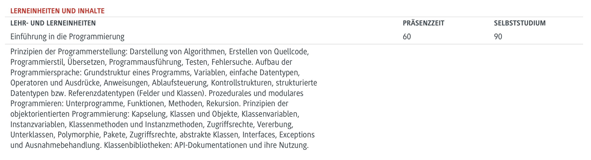<!-- .element style="border: 0px; box-shadow: 0 0 0 0" -->
</div>

----
## Anmerkung zum Inhalt - anderer Blickwinkel
<table>
<tr>
<th>Vor dem 1. Semester</th>
<th>➡️</th>
<th>Nach dem 2. Semester</th>
</tr>
<tr>
<td width=45%>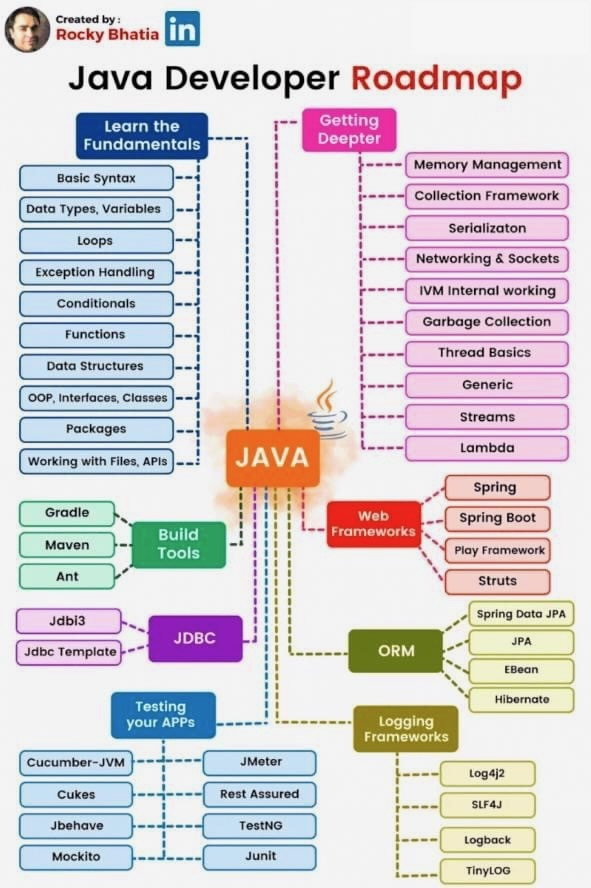<!-- .element style="border: 0px; box-shadow: 0 0 0 0" --></td>
<td width=10% style="vertical-align:middle"></td>
<td width=45%>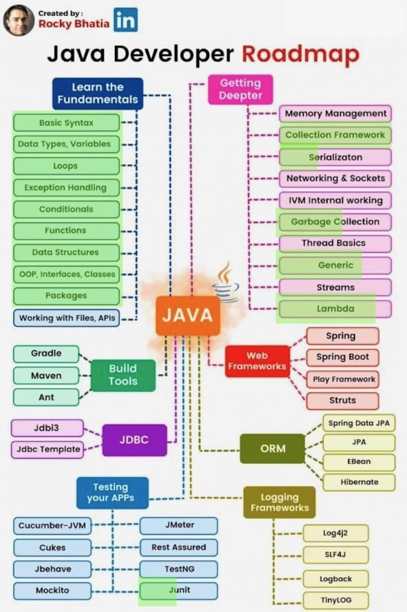<!-- .element style="border: 0px; box-shadow: 0 0 0 0" --></td>
</tr>
</table>

----
## Quellen & Literaturverzeichnis

<ul>
<li>RATZ / SCHULMEISTER-ZIMOLONG / SEESE / WIESENBERGER<br>Grundkurs Programmieren in Java. Hanser, 8. Auflage, 2018. ISBN 978-3-446-45212-1</li><!-- .element style="font-size: 0.9em;" -->
</ul>


---
## Kapitelübersicht - Programmieren 1
1. Einführung
2. Grundlagen von Java
3. Datentypen
4. Ausdrücke und Anweisungen
5. Objektorientierung
6. Vererbung
7. Interfaces

### Exkurse
* Naming conventions
* Implizite Typisierung mittels ```var```
* Unit Testing


---
# Kapitel 1
# Einführung

----
## Übersicht
1. **Einführung**
2. Grundlagen von Java
3. Datentypen
4. Ausdrücke und Anweisungen
5. Objektorientierung
6. Vererbung
7. Interfaces

----
## Lernziele
* Sie können den Begriff Algorithmus definieren
* Sie kennen die Eigenschaften und Bestandteile von Algorithmen
* Sie können die Grundbegriffe der Programmierung nennen und einsetzen
* Sie kennen unterschiedliche Darstellungsformen von Algorithmen
* Sie können einfache Algorithmen in Form von Pseudocode, Programmablaufplänen und Struktogrammen darstellen

---
## Ziel der Programmierung
Umsetzung eines gegebenen oder selbstentwickelten Algorithmus in ein lauffähiges Computerprogramm

<div align="center" width="90%">
<!-- .element style="border: 0px; box-shadow: 0 0 0 0" -->
</div>

----
## Algorithmus
<div align="center" width="90%">
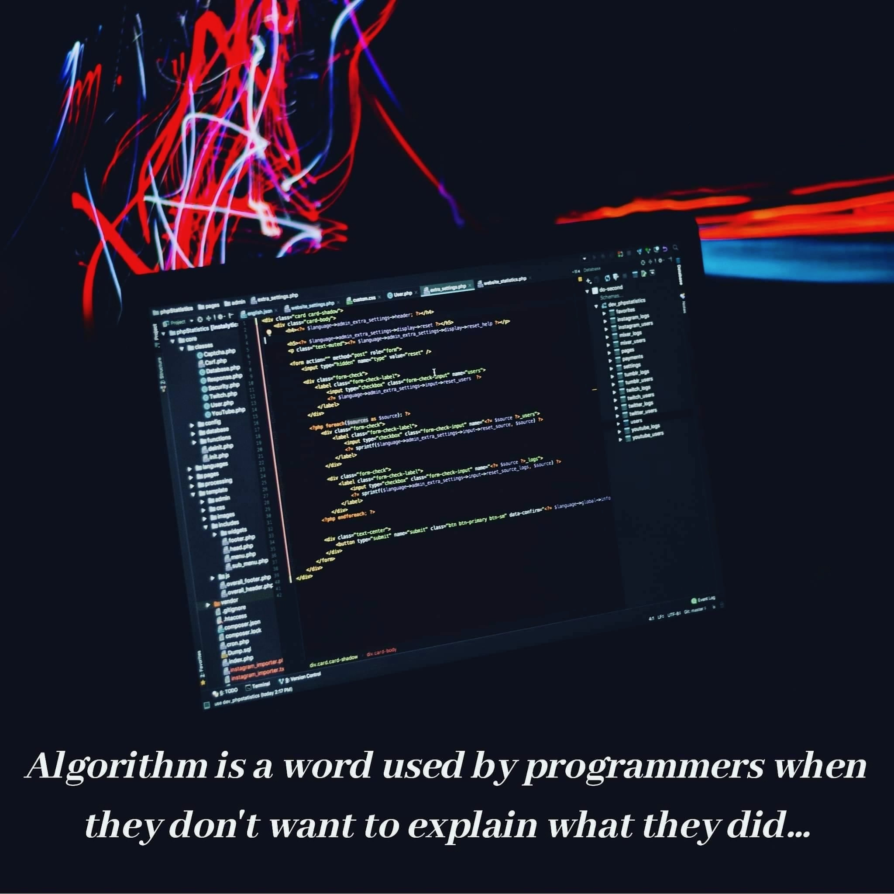<!-- .element style="border: 0px; box-shadow: 0 0 0 0" -->
</div>

----
## Beispiele für Algorithmen
<table>
<tr style="vertical-align:middle">
<td>
<ul>
<li>Bedienungsanleitungen</li>
<li>Bauanleitungen</li>
<li>Kochrezepte</li>
<li>mathematische Problemstellungen</li>
<li>Such- und Sortieralgorithmen</li>
</ul>
</td>
<td style="vertical-align:middle">
<!-- .element style="border: 0px; box-shadow: 0 0 0 0" --><br/><br/>
<!-- .element style="border: 0px; box-shadow: 0 0 0 0" -->
</td>
<td style="vertical-align:middle">
<!-- .element style="border: 0px; box-shadow: 0 0 0 0" -->
</td>
</tr>
</table>

----
## Beispiel: Ein Kochrezept (!)
<table width=100%>
<tr><th width=40%>Zutaten</th><th>Zubereitung</th></tr>
<tr>
  <td>
    <ul>
      <li>500 g Hackfleisch vom Rind</li>
      <li>2 große Zwiebeln, fein gehackt</li>
      <li>4 Stangen Staudensellerie, fein gehackt</li>
      <li>150 g Speck, fein gehackt</li>
      <li>2 Zehen Knoblauch, fein gehackt</li>
      <li>400 g geschälte Tomaten</li>
      <li>300 ml Fond (Bratenfond)</li>
      <li>1 Paprikaschote, rot, klein gewürfelt</li>
      <li>1 Gewürznelke</li>
      <li>1 Lorbeerblatt</li>
      <li>½ TL Oregano</li>
      <li>½ TL Muskat (gemahlen)</li>
      <li>3 EL Öl (Oliven)</li>
      <li>40 g Butter</li>
      <li>150 ml Wein, rot, trocken</li>
      <li>1 Chilischote, zerkleinert, getrocknet</li>
    </ul><!-- .element style="font-size: 0.6em;" -->
  </td>
  <td>Butter und Öl in einer Pfanne (besser Bräter) erhitzen. Zwiebeln, Sellerie, Speck und Paprika gut anbraten. Die Sachen aus der Pfanne nehmen und zur Seite stellen. Den Knoblauch leicht anrösten und dann das Hackfleisch dazugeben, alles gut anbraten. Die Sachen wieder dazugeben und alles ca.10 Min. köcheln lassen. Jetzt alle übrigen Zutaten und Gewürze dazugeben und das Ganze ca. 45 Min. ( bei geschlossenem Deckel ) köcheln lassen (gelegentlich abschmecken und ggf. nachwürzen). Über die fertig gegarten Spaghetti geben.</td><!-- .element style="font-size: 0.6em;" -->
  </tr>
</table>
----
## Probleme bei diesem Beispiel
* Zutaten sind bereits vorbereitet
* Spaghetti fehlen bei Zutaten
* Beschreibung für Zubereitung der Spaghetti fehlt
* ungenaue Aussagen
  * fein gehackt
  * klein gewürfelt
  * erhitzen
  * gut anbraten
  * leicht anrösten
  * …
* Pfanne (besser Bräter)

KURZ: Die Beschreibung lässt Raum für individuelle Entscheidungen und Interpretationen.

----
## Verbesserungsmöglichkeiten des Rezepts
<div>

* komplette Eliminierung von individuellen Interpretationsspielräumen
* vollständige Beschreibung der Arbeitsschritte inkl. Vorbereitung und der Kochanweisung für die Spaghetti
* vollständige Angabe der Zutaten
präzise Angaben bei den Aussagen
  * fein gehackt &#8658; gewürfelt, 2 mm ≤ Kantenlänge ≤ 3 mm(Zwiebeln und Speck)
  * fein gehackt &#8658; gewürfelt, 0,8 mm ≤ Kantenlänge ≤ 1 mm(Knoblauch)
  * klein gewürfelt &#8658; 4 mm ≤ Kantenlänge ≤ 6 mm
  * erhitzen &#8658; 120 °C < Temperatur < 125 °C
  * gut anbraten &#8658; Farbe der Zwiebeln entspricht dem RGB-Wert <span>CC3300</span><!-- .element style="background-color: #CC3300;" -->
  * leicht anrösten &#8658; Farbe des Knoblauchs entspricht dem RGB-Wert <span>CC6600</span><!-- .element style="background-color: #CC6600;" -->
</div><!-- .element style="font-size: 0.8em;" -->

---
## Algorithmus: Definition
### Duden<!-- .element style="text-align: left;" -->
> Al|go|rith|mus, der; ­, ...men [mlat. algorismus = Art der indischen Rechenkunst, in Anlehnung an griech. arithmós = Zahl entstellt aus dem Namen des pers.- arab. Mathematikers Al-Hwarizmi, gest. nach 846] (Math., Datenverarb.): Verfahren zur schrittweisen Umformung von Zeichenreihen; Rechenvorgang nach einem bestimmten [sich wiederholenden] Schema. <!-- .element style="font-size: 0.6em;" -->

### Informatik<!-- .element style="text-align: left;" -->
> Ein Algorithmus ist eine präzise (d.h. in einer festgelegten Sprache abgefasste) endliche Beschreibung eines allgemeinen Verfahrens unter Verwendung ausführbarer elementarer (Verarbeitungs-)Schritte. <!-- .element style="font-size: 0.6em;" -->

----
## Algorithmus: Eigenschaften
### Terminierung<!-- .element style="text-align: left;" -->

* bricht nach endlich vielen Schritten ab

***

### Determinismus<!-- .element style="text-align: left;" -->


* legt die „Wahlfreiheit“ fest
* deterministischer Ablauf
  * legt eindeutige Vorgabe der Schrittfolge der auszuführenden Schritte fest
* determiniertes Ergebnis
  * wird immer dann geliefert, wenn bei vorgegebener Eingabe ein eindeutiges Ergebnis geliefert wird - auch bei mehrfacher Durchführung mit denselben Eingabeparametern


***

----
## Algorithmus: Bestandteile
* elementare Operationen (Ausdrücke und Anweisungen)<br/>Berechne 5 plus 7
* sequenzielle Ausführung
<br/>Berechne 10 minus 3, dann multipliziere das Ergebnis mit 4
* parallele Ausführung
<br/>Du rechnest Aufgabe 1 und ich rechne Aufgabe 2
* bedingte Ausführung
<br/>Wenn Du Aufgabe 1 gelöst hast, dann beginne mit Aufgabe 2
* Schleife
<br/>Rechne Aufgabe 1, bis Du das richtige Ergebnis bekommst
* Unterprogramm
<br/>Rechne Aufgabe 1 anhand der Lösung auf Seite 106

* Variablen und Konstanten

---
## Grundbegriffe der Programmierung
Ausdruck
* Kombination von Operanden und Operatoren als "Vorschrift" zur Berechnung eines Werts
* liefert immer einen Wert (Ergebniswert) ab
* Beispiel: 1 / x

Anweisung
* Kombination von Ausdrücken und Methoden als "Vorschrift" zur Ausführung einer Aktion
* Beispiele:
<br/>y = 1 / x Wertzuweisung
<br/>print(x) Ausgabeanweisung (Methodenaufruf "Drucke x")

----
## Grundbegriffe der Programmierung
Sequenz
* bildet eine zeitliche Abfolge von Anweisungen
* einzelne Schritte werden durchnummeriert oder es wird zum Abschluss der Sequenz ein Semikolon gesetzt

Bedingte Anweisung
* es werden Bedingungen auf Ihre Richtigkeit geprüft
* für wahre und falsche Aussagen in der Bedingung können unterschiedliche Anweisungen ausgeführt werden

Schleifen
* bestimmte Anweisungen werden wiederholt, bis eine definierte Endbedingung erfüllt wird
* Unterscheidung in drei Schleifenarten

----
## Grundbegriffe der Programmierung
Unterprogramme
* beinhaltet einen Teilalgorithmus
* dieser Teilalgorithmus kann in mehreren Algorithmen wieder verwendet werden

Variablen
* „Platzhalter“ für einen konkreten Wert
* sind von einem bestimmten Datentyp
können ihren Wert ändern

Konstanten
* haben einen festen Wert
* sind von einem bestimmten Datentyp
* können ihren Wert NICHT ändern

---
## Darstellungsformen von Algorithmen
Pseudocode
* nahe an den Konstrukten verbreiteter Programmiersprachen
* Verwendung spezieller englischer Begriffe aus dem Alltag
* Begriffe haben eine festgelegte Bedeutung

Programmablaufpläne
* genormt nach DIN 66001
* Ursprung in der linearen Programmierung
* nur für kleinere Programme geeignet (Übersichtlichkeit)

Nassi-Schneiderman-Diagramme (Struktogramme)
* Entstehung 1973
* Darstellung genormt nach DIN 66261 im Jahr 1985
* überwiegender Einsatz in der prozeduralen Programmierung

---
## Pseudocode
<div>

Sequenz
* Alternative 1: Schritte werden durchnummeriert: 1, 2, 3, …
* Alternative 2: Abschluss der Sequenz durch Semikolon
* Vorteil Alternative 1: Verfeinerung einzelner Schritte: 2.1, 2.2, …

Bedingte Anweisung
* es werden Bedingungen auf Ihre Richtigkeit geprüft
* Alternative 1: falls Bedingung dann Schritt
* Alternative 2: falls Bedingung dann Schritt A sonst Schritt B

Schleifen
* kopfgesteuert: solange Bedingung wahr führe aus Schritte
* fußgesteuert: wiederhole Schritte bis Bedingung wahr
* Zählschleife: wiederhole für Zahlenbereich Arbeitsschritte
</div><!-- .element style="font-size: 0.9em;" -->
----
### Beispiel: Pseudocode

<div>

<table>
<tr>
<td>

<h3>Sequenz</h3>
<ol>
<li>Koche Wasser</li>
<li>Gib Kaffeepulver in Tasse</li>
<li>Fülle Wasser in Tasse</li>
</ol>
<p>
<p>
<h3>Bedingte Anweisung</h3>
&nbsp;&nbsp;<b>falls</b> Ampel rot oder gelb<br/>
&nbsp;&nbsp;&nbsp;&nbsp;<b>dann</b> stoppe<br/>
&nbsp;&nbsp;&nbsp;&nbsp;<b>sonst</b> fahre weiter
</p>
<p>
&nbsp;&nbsp;<b>falls</b> Ampel ausgefallen<br/>
&nbsp;&nbsp;&nbsp;&nbsp;<b>dann</b> fahre vorsichtig weiter<br/>
&nbsp;&nbsp;&nbsp;&nbsp;<b>sonst falls</b> Ampel grün<br/>
&nbsp;&nbsp;&nbsp;&nbsp;&nbsp;&nbsp;<b>dann</b> fahre weiter<br/>
&nbsp;&nbsp;&nbsp;&nbsp;&nbsp;&nbsp;<b>sonst</b> stopp
</p>
</p>
</td>

<td>
<h3>Schleifen</h3>
<p>
<b>solange</b> Liste nicht erschöpft<br/>
&nbsp;&nbsp;<b>führe aus</b><br/>
&nbsp;&nbsp;&nbsp;&nbsp;Gib nächste Zahl aus der Liste aus
</p>
<p>
<b>wiederhole</b><br/>
&nbsp;&nbsp;Gib nächste Zahl aus der Liste aus<br/>
<b>bis</b> Liste erschöpft
</p>
<p>
<b>wiederhole für</b> 5 bis 10<br/>
&nbsp;&nbsp;Gib nächste Zahl aus der Liste aus
</p>
</td>
</tr>
</table>

</div><!-- .element style="font-size: 0.7em;" -->
---
## Struktogramme
<!-- .element style="border: 0px; box-shadow: 0 0 0 0" --></td>

---
## Programmablaufplan
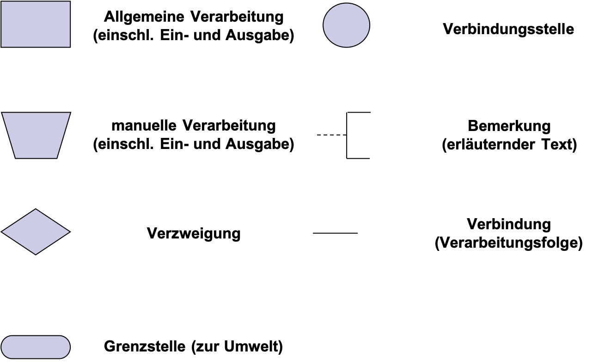<!-- .element style="border: 0px; box-shadow: 0 0 0 0" --></td>

----
## Beispiel: Programmablaufplan
<!-- .element style="border: 0px; box-shadow: 0 0 0 0" --></td>

---
## Beispiel: Mathematische Problemstellung
<!-- .element style="border: 0px; box-shadow: 0 0 0 0" --></td>


**Übung:** Erstellen Sie zum beschriebenen des euklidschen Algorithmus ein Struktogramm und einen Programmablaufplan.

---
# Kapitel 2
# Grundlagen von Java

----
## Übersicht
1. Einführung
2. **Grundlagen von Java**
3. Datentypen
4. Ausdrücke und Anweisungen
5. Objektorientierung
6. Vererbung
7. Interfaces

----
## Lernziele
* Sie können die Eigenschaften der Programmiersprache Java beschreiben
* Sie kennen die Aufgaben von Compiler, Linker und Interpreter
* Sie können das Zusammenspiel von Bytecode und der Java Virtual Machine erläutern
* Sie können die wesentlichen Java-Tools benennen und ihre Aufgabe beschreiben
* Sie können das Paketkonzept in Java erläutern
* Sie kennen die wesentlichen Systemvariablen im Umfeld von Java
* Sie können IntelliJ als Java-Entwicklungsumgebung einsetzen

---
## Vorbereitung
* [prüfen] Installieren Sie das Java Developer Kit, falls notwendig. [JDK Download von Oracle](https://www.oracle.com/technetwork/java/javase/downloads/index.html)

```
java --version
java -version
```

* Aktivieren Sie eine Studierenden-Lizens und installieren Sie IntelliJ [Jetbrains Free License for faculty members - DHBW-Email benötigt](https://www.jetbrains.com/student/)
* Coding Beispiele in Repository >> "dhbwmawwi[YYYY]se[Kurs]" auf [github.com](https://github.com/)
---
## Klassifizierung von Software
* Programme zur Steuerung der Verarbeitungsprozesse, der Übertragungsprozesse und der Speicherungsprozesse in Computern
* unterschiedliche Softwarearten
  * Systemsoftware
    * grundlegende Dienste für andere Programme
    * Steuerung des Computersystems (Hardware)
    * Ablaufsteuerung anderer Programme
  * Entwicklungssoftware
    * Erstellung und Modifikation von Programmen
    * Übersetzungsprogramme für Programmiersprachen
  * Anwendungssoftware
    * Programme zur Verarbeitung der Daten
    * Unterhaltungssoftware
    * Spiele

---
## Eigenschaften von Java
* vollständig objektorientiert
  * ohne prozedurale Altlasten
* unkompliziert - einfach und leicht erlernbar
  * Syntax ähnlich zu C, C++
  * Beschränkung auf das Notwendigste
  * keine Pointer
  * keine Header-Dateien
  * keine Präprozessor-Anweisungen
  * keine Mehrfachvererbung
* plattformunabhängig (architekturneutral)
  * übersetzte Java-Programme (Bytecode) sind auf jeder javafähigen Plattform ausführbar
  * fest definierter Wertebereich für Zahlen
----
## Eigenschaften von Java
* sicher
  * keine direkten Speicherzugriffe mit * Pointerarithmetik
  * strenge Typüberprüfung
  * keine Programmierung mit Sprachverletzung
* robust
  * keine Rechnerabstürze durch Programmierfehler
  * Überprüfung der Speicherzugriffe
  * Ausnahmeroutinen zur Fehlerbehandlung
* multithreaded
  * parallele Ausführung von Programmteilen
* internetfähig
  * Java-Applets sind über das Internet verteilbar und können lokal auf dem Rechner ausgeführt werden

---
## Umwandlung von Quellcode in Maschinensprache

----
### Compiler
<div align="center" width="90%">
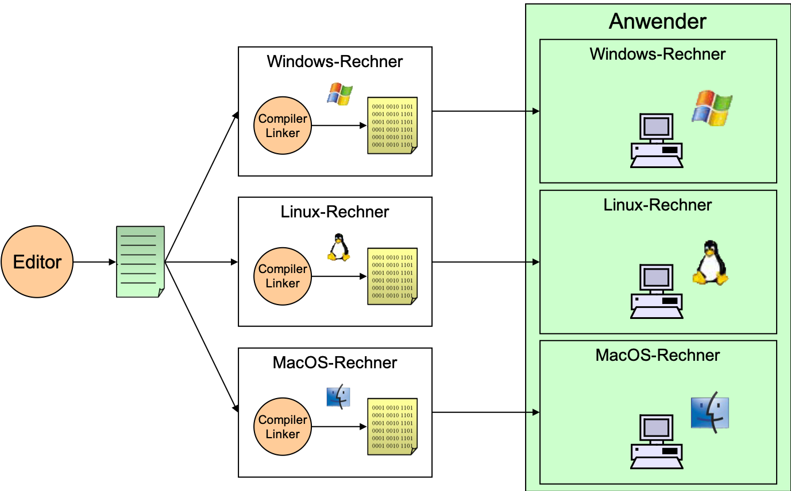<!-- .element style="border: 0px; box-shadow: 0 0 0 0" -->
</div>

----
### Funktionsweise eines Compiler
* übersetzt ein Computerprogramm aus einer Quellsprache in ein semantisch äquivalentes Programm einer Zielsprache
* Aufbau eines Compilers in 2 Phasen
  * Analysephase
    * lexikalische Analyse zerteilt Code in zusammengehörende Token
    * syntaktische Analyse überprüft auf formale Richtigkeit
    * semantische Analyse überprüft die logischen Rahmenbedingungen
  * Synthesephase
    * Zwischencodeerzeugung liefert die Basis für die Optimierung
    * Programmoptimierung auf Basis des maschinennahen Zwischencodes
    * Codegenerierung erzeugt den Programmcode der Zielsprache

----
### Arten von Compilern
* Native Compiler erzeugt Code für die Plattform, auf der er läuft
* Cross-Compiler erzeugt Code für andere Plattformen
* One-pass-Compiler erzeugt den Code in einem Durchlauf
* Multi-pass-Compiler erzeugt den Code in mehreren Durchläufen

----
### Linker
* stellt einzelne Programmmodule zu einem ausführbaren Programm zusammen
* fügt benötigten Code aus Funktionsbibliotheken zum Code des Hauptprogramms hinzu
* statisches Linken
  * beim kompilieren werden benötigte Codings aus Funktionsbibliotheken dem Coding des Hauptprogramms hinzugefügt
* dynamisches Linken
  * zur Laufzeit werden die Codings aus Funktionsbibliotheken o.ä. zum Hauptprogramm hinzugelinkt
    * DLL-Konzept von Windows
    * auch bei Java findet dynamisches Linken statt

----
### Interpreter
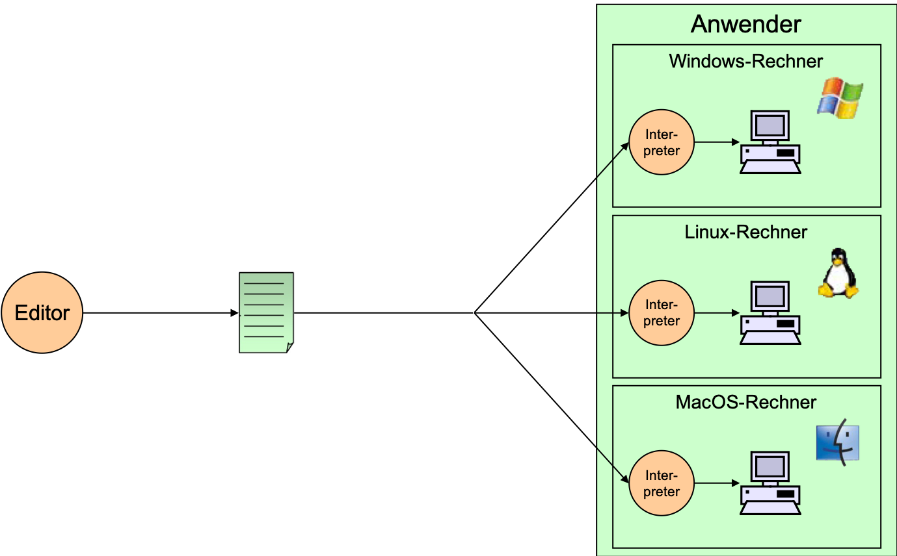<!-- .element style="border: 0px; box-shadow: 0 0 0 0" -->

----
### Funktionsweise eines Interpreters

<div>

* übersetzt den Quellcode nicht in eine direkt ausführbare Datei
* liest den Quellcode ein, analysiert diesen und führt ihn dann aus
* die Analyse erfolgt also zur Laufzeit des Programms
* auf jeder Rechnerarchitektur lauffähig
* deutlich langsamer als kompilierte Programme
* Möglichkeiten zur Steigerung der Geschwindigkeit
  * Just-In-Time-Compiler
    * zur Laufzeit wird der Quellcode in einen Maschinencode übersetzt
    * Maschinencode wird direkt vom Prozessor ausgeführt
    * mehrfach durchlaufene Programmteile müssen nur ein Mal übersetzt werden
    * nur auf einer bestimmten Rechnerarchitektur lauffähig
  * Bytecode-Interpreter
    * Quellcode wird zur Laufzeit in sog. Bytecode übersetzt
    * Bytecode wird von einem Interpreter (Virtual Machine) ausgeführt
    * Bytecode kann auf verschiedenen Plattformen ausgeführt werden
</div><!-- .element style="font-size: 0.9em;" -->
---
## Javaquellcode zu Maschinensprache

----
### Platformunabhängigkeit durch Bytecode
<div align="center" width="90%">
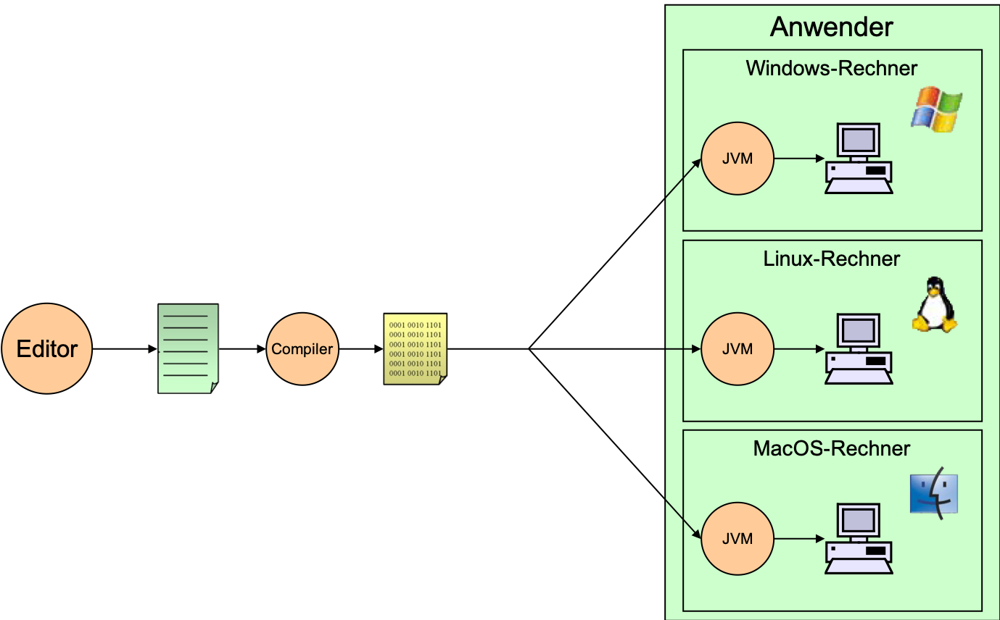<!-- .element style="border: 0px; box-shadow: 0 0 0 0" -->
</div>

----
### Bytecode und virtual Machine
<div align="center" width="90%">
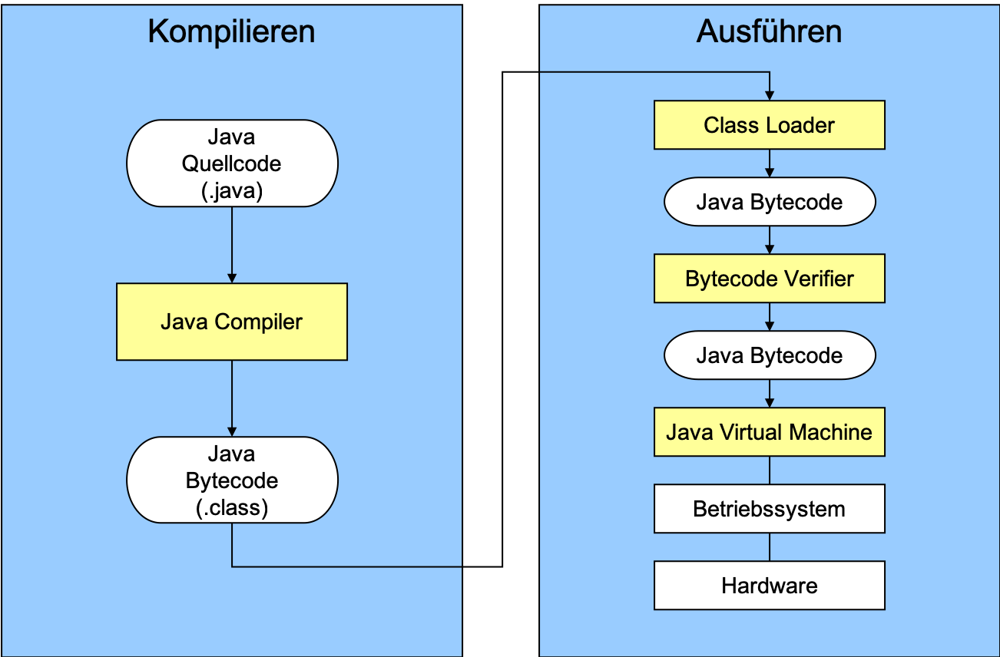<!-- .element style="border: 0px; box-shadow: 0 0 0 0" -->
</div>

----
### Wesentliche Java-Tools
Java-Compiler (javac.exe)

Java virtual Machine (java.exe)

Javadoc
* dient der automatischen Erstellung von Dokumentationen

Class Loader
* lädt Java-Klassen in den Arbeitsspeicher
* bereitet Ausführung von Java-Applikationen vor

Bytecode Verifier
* Prüfung auf syntaktische Korrektheit
* Überprüfung der Klassenhierarchie
* Überprüfung jeder Methode auf strukturelle Gültigkeit
* Datenflussanalyse, um u.a. Typfehler zu vermeiden


----
### Wichtige Systemvariablen (!)
<table>
<tr style="vertical-align:middle">
<td>
PATH
<ul><li>Verzeichnis, in dem sich die JAVA-Tools befinden</li></ul>

CLASSPATH
<ul><li>Verzeichnisse, in denen nach Klassen und Paketen gesucht werden soll</li></ul>

JAVA_HOME
<ul><li>Verzeichnis, in dem das J2SDK installiert wurde</li></ul>

</td>
<td style="vertical-align:middle">
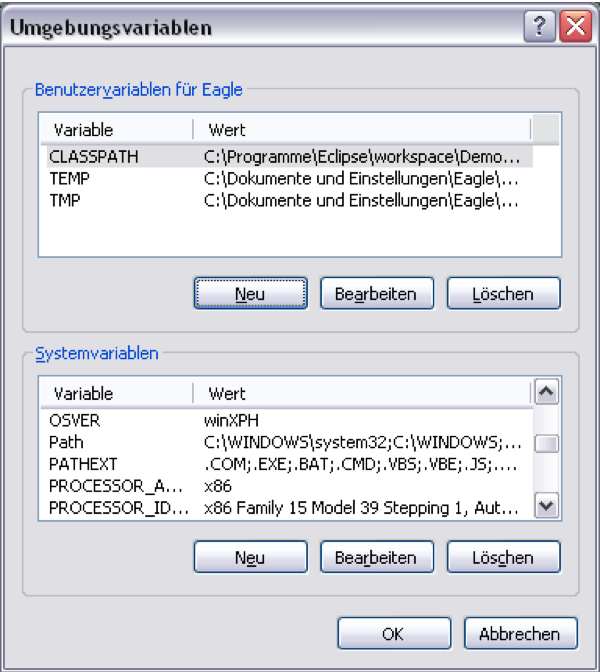<!-- .element style="border: 0px; box-shadow: 0 0 0 0" -->
</td>
</tr>
</table>

----
### Beispiel: Hello World über die Konsole
1. anlegen einer Datei "HelloWorld.java" mit folgendem Quellcode

```java
class HelloWorld {

  public static void main (String[] args){
    System.out.println("Hello to the Java World");

  }
}
```

2. Quellcode zu Bytecode kompilieren

```
javac HelloWorld.java
```
3. Ausführen des komplilierten Bytecode in Java Virtial Machine (JVM)

```
java HelloWorld
```

----
### Java - Kommentare im Quellcode
Einzeiliger Kommentar

```java
// single line comment -
```

Blockkommentar (Mehrzeiliger Kommentar)

```java
/*
multi line comment
starting with the signs

ending with the signs
*/
```

Beispiel

<div>

```java
// HelloWorld class as first small programming example
class HelloWorld {

  // main method as starting point in Code
  public static void main (String[] args){
    /*
    Implementation of main method
    prints out "Hello to the Java World"
    to the console.
    */
    System.out.println("Hello to the Java World");
  }
}
```
</div><!-- .element style="font-size: 0.9em;" -->

---
### Exkurs: JavaDoc (!)
#### Generierung von Dokumentation aus Javaquellcode und Kommentaren
* Generiert Dokumentation anhand des Quellcodes
* Kommentare mit spezieller Formatierung ("/** ") werden berücksichtig
* Resultat: Dokumentation im HTML-Format

Beispiel:

```java
/** HelloWorld class as first programming example
* @author Matthias Berg-Neels
* @version 1.0
* @since 1.0
*/
public class HelloWorld {

  /** main method as starting point for program start
  * @param args String array for parameters from the console
  */
  public static void main (String[] args){

    System.out.println("Hello to the Java World");
  }
}
```
----
#### Generierung der Dokumentation (!)

```
javadoc HelloWorld.java -author -version
```

Ergebnis:

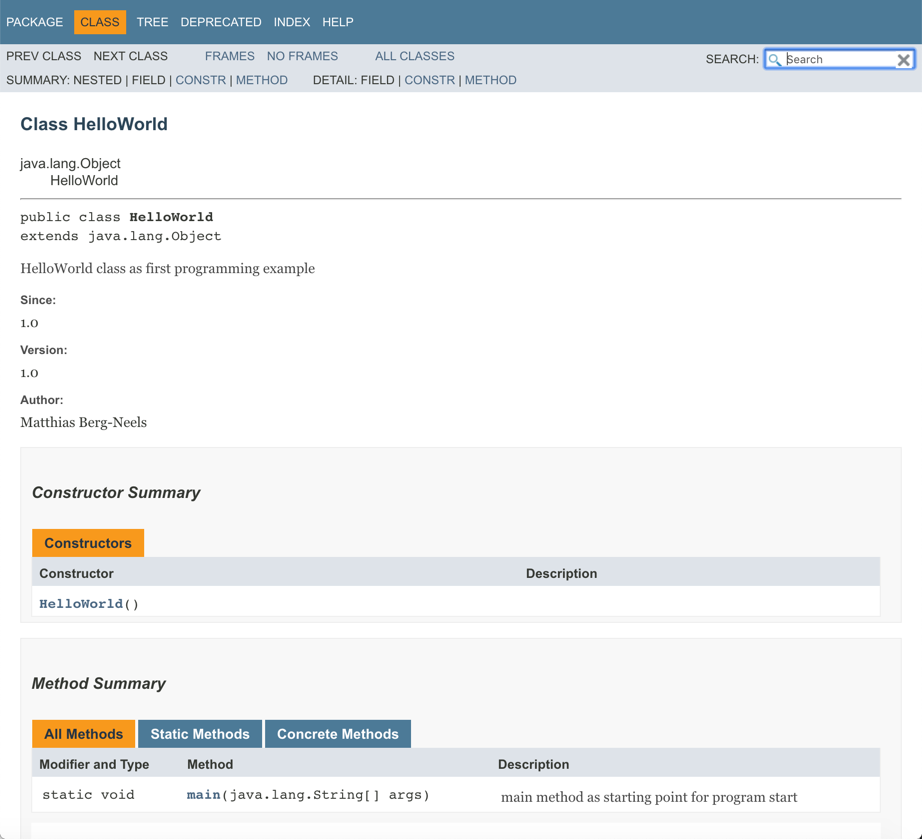<!-- .element style="border: 0px; box-shadow: 0 0 0 0" -->

Java Entwicklung: "Eat your own dog food!" --> <a href='https://docs.oracle.com/en/java/javase/15/docs/api/index.html' target=_blank>JDK Dokumentation</a>

---
## Das Paketkonzept in Java
* Möglichkeit zur Strukturierung bzw. sinnvollen Sortierung von Klassen
* Pakete sind somit Sammlungen von Klassen
* die Klassen verfolgen einen gemeinsamen Zweck
* jede Klasse ist genau einem Paket zugeordnet
* Paketnamen können aus mehreren Teilen bestehen und hierarchisch aufgebaut sein (vergleichbar mit der Ordnerstruktur im Windows-Explorer)
* eine Klasse kann eindeutig über das Paket und ihren Namen identifiziert werden

---
## Funktionsumfang der Java 2™ Platform (!)
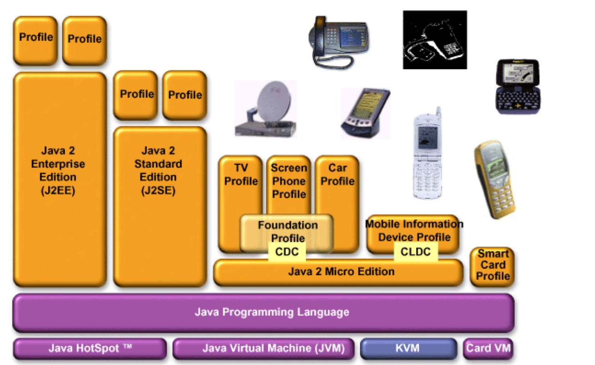<!-- .element style="border: 0px; box-shadow: 0 0 0 0" -->

----
## Funktionsumfang der Java 2™ Platform (!)
<div>

* Java 2 Standard Edition beinhaltet das Software Development Kit mit der Standard API zur Entwicklung von Java-Applikationen
* Java 2 Enterprise Edition umfasst neben der J2SE weitere Packages zur serverseitigen Programmierung (Enterprice Java Beanss, Servlets, JSP, Java-Mail-API, etc.)
* Java 2 Micro Edition stellt eine funktional kleinere Laufzeitumgebung für mobile Endgeräte (PDAs, Handys, Navigationssysteme, etc.) dar
* Connected Device Configuration (CDC) beinhaltet die komplette JVM und ist in mobilen Systemen integriert
* Connected Limited Device Configurations (CLDC ) ist eine J2ME-Bibliothek zur Abdeckung gerätespezifischer Funktionen; ermöglicht die Zusammenarbeit verschiedener Geräte der gleichen Kategorie
* KVM ist die kleinste Laufzeitumgebung und wird für den Einsatz auf Geräten mit beschränkter Speicherkapazität und CPU-Leistung verwendet
* Java Card APIs definieren eine minimale Laufzeitumgebung auf SmartCards
</div><!-- .element style="font-size: 0.8em;" -->
---
## Entwicklungsumgebung
### IntelliJ IDEA (!)

* Entwickler: [Jetbrains](http:www.jetbrains.com)
* Integrated Development Environment (IDE) für unterschiedliche Programmierspachen und Umgebungen
  * **Java**, Javascript (Node.js), Android, Kotlin, ...
* freie Community Edition
* seit Version 9.0: kostenpflichtige Version (sehr beliebt)
* seit Version 14.0: Decompiler für Java Bytecode
* Erweiterbarkeit durch Plug-Ins
* verschiedene Ableger für weitere Programmiersprachen
  * z.B. Webstorm für PHP

---
# Kapitel 3
# Datentypen

----
## Übersicht
1. Einführung
2. Grundlagen von Java
3. **Datentypen**
4. Ausdrücke und Anweisungen
5. Objektorientierung
6. Vererbung
7. Interfaces

----
## Lernziele
* Sie kennen die unterschiedlichen einfachen Datentypen in Java
* Sie kennen die Wertebereiche der jeweiligen Datentypen
* Sie können Variablen und Konstanten in Java deklarieren
* Sie kennen die unterschiedlichen Literale
* Sie kennen unterschiedliche Standard-Escape-Sequenzen und können diese einsetzen
* Sie kennen die Konvertierungsvorschriften bezüglich der einfachen Datentypen
* Sie können den Aufbau von Arrays beschreiben
* Sie können Arrays in Java deklarieren
* Sie kennen den theoretischen Umgang mit Referenzdatentypen
* Sie kennen die speziellen Referenzdatentypen Array und String

---
## Arten von Datentypen
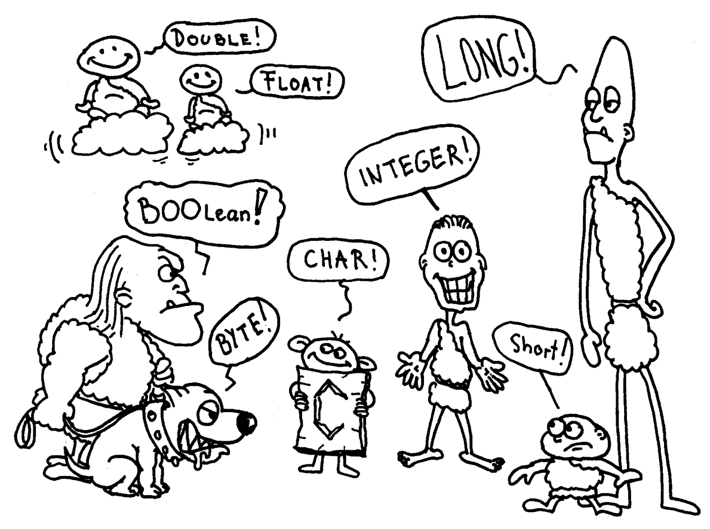<!-- .element style="border: 0px; box-shadow: 0 0 0 0" -->
----
## Arten von Datentypen
* bool‘sche Typen sind Wahrheitswerte: True und False

* numerische Typen
  * Byte, Short, Integer und Long: Menge der ganzen Zahlen
  * Double und Float: Menge der reellen Zahlen

* alphanumerisch
  * Char: Menge der vereinbarten Schriftzeichen, z.B. ASCII-Zeichensatz

* komplexe Datentypen
  * String: Verkettung von Character-Werten &#8658; Zeichenketten
  * Array: Definition eines n-dimensionalen Feldes
  * Referenzdatentypen: Individuell definierte Datentypen

----
## Wertebereiche und Speicherverbrauch
|Typname|Länge in Byte|Wertebereich|
|:------|:-----------:|:-----------|
|boolean|1|*true, false*|
|char|2|Alle Unicode-Zeichen|
|byte|1|-2<sup>7</sup> bis 2<sup>7</sup>-1 (-128 bis 127)|
|short|2|-2<sup>15</sup> bis 2<sup>15</sup>-1 (-32.768 bis 32.767)|
|int|4|-2<sup>31</sup> bis 2<sup>31</sup>-1 (-2.147.483.648 bis 2.147.483.647)|
|long|8|-2<sup>63</sup> bis 2<sup>63</sup>-1 (-9.223.372.036.854.775.808 bis          9.223.372.036.854.775.807)|
|float|4|+/- 3.40282347 * 10<sup>38</sup>|
|double|8|+/- 1.79769313486231570 * 10<sup>308</sup>|

---
## Deklaration von Variablen
* Variablen werden durch Datentyp und Variablennamen deklariert
```java
Typname Variablenname;
```
* Beispiele für Variablendeklarationen
```java
boolean muede;
int a;
```
* Beispiele für Deklarationen mit Initialisierung
```java
char buchstabe = ‘a‘;
long zahl = 45768;
```
----
## Deklaration von Konstanten
* Konstanten werden ähnlich wie Variablen deklariert
vor den Typnamen wird das Schlüsselwort
```java
final gesetzt final Typname Konstantenname;
```
* Konstanten können nach der Deklaration einmalig mit einem Wert initialisiert werden
```java
final double pi = 3.1415926535897932384626433832795;
```
---
## Literale
> Ein Literal (lateinischen *littera* "Buchstabe") in der Programmiersprache bezeichnet fest definierte Zeichenfolgen zur Darstellung von Werten für Basis-Datentypen.

----
## Numerische Literale
### Ganzzahlen
Literale für die Familie der Integer-Werte (byte, short, int, long) können in Dezimal-, Oktal- oder Hexadezimalform geschrieben werden

* Dezimalliterale bestehen aus den Ziffern 0 bis 9
* Oktalliterale bestehen aus dem Präfix 0 und den Ziffern 0 bis 7
* Hexadezimalliterale bestehen aus dem Präfix 0x, den Ziffern 0 bis 9 und den Buchstaben A bis F bzw. a bis f
* durch das Suffix l bzw. L wird ein Literal vom Typ long erzeugt
----
## Numerische Literale
### Fließkommazahlen
Literale für Fließkommazahlen float und double
* bestehen aus einem Vorkommateil, dem Dezimalpunkt, einem Nachkommateil, einem Exponenten und einem Suffix
* Unterscheidung zwischen float und double durch das Suffix f bzw. d
* Exponent wird durch ein e bzw. E eingeleitet
* Vorkomma- oder Nachkommateil darf ausgelassen werden, der Exponent und das Suffix sind optional
* ohne Suffix sind Fließkommazahlen immer vom Typ double

----
## Alphanumerische Literale
* besondere Literale für den Datentyp boolean

*true und false*
***
* Char-Literale werden grundsätzlich in einfache Hochkommata gesetzt
* Char-Variablen sind prinzipiell 2 Byte lang, da in char Unicode-Werte gespeichert werden können

```java
'a';
'\u2764';
```
***
* besondere Zeichenliterale stellen die String-Literale dar
* String-Literale stehen in doppelten Hochkommata

```java
"Hier ist eine Zeichenkette"
```

----
## Text Blocks (seit Java 15)

* bisher

<div>

```Java
String html = "<html>\n" +
              "\t<body>\n" +
              "\t\t<p>Hello, world</p>\n" +
              "\t</body>\n" +
              "</html>";
```

</div><!-- .element style="font-size: 0.9em;" -->

* neu

<div>

```Java
String html = """
<html>
  <body>
    <p>Hello, world</p>
  </body>
</html>
""";
```

</div><!-- .element style="font-size: 0.9em;" -->

----
## Standard-Escape-Sequenzen
* Zeichenliterale können Standard-Escape-Sequenzen zur Darstellung von Sonderzeichen beinhalten
* Beispiele:

|Zeichen|Bedeutung|
|:-----:|:--------|
|\t|Horizontaler Tabulator|
|\n|Zeilenschaltung (Newline)|
|\“|Doppeltes Anführungszeichen|
|\‘|Einfaches Anführungszeichen|
|\\\\|Backslash|
|\uxxxx|Unicodezeichen (xxxx steht für den Hexadezimalwert des Unicodezeichens)|

---
## Konvertierungsregeln
* generelle Unterscheidung in erweiternde und einschränkende Konvertierung
* es existiert keine Konvertierungsvorschrift für den Datentyp boolean und für die Konvertierung zwischen einfachen und Referenzdatentypen

<div align="center" width="90%">
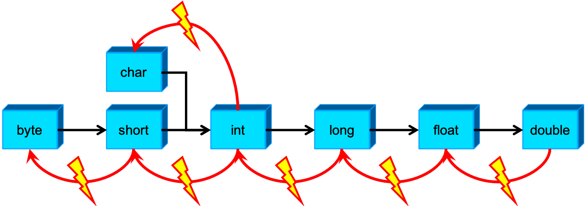<!-- .element style="border: 0px; box-shadow: 0 0 0 0" -->
</div>


---
## Arrays
* Arrays sind (mehrdimensionale) Feldvariablen, die aus mehreren Elementen bestehen
* alle Elemente eines Arrays gehören dem gleichen Datentyp an
* in Java sind Arrays semidynamisch, d.h. ihre Größe kann zur Laufzeit festgelegt, aber danach nicht mehr verändert werden
* Arrays in Java sind Objekte und bieten verschiedene Methoden
* die Elemente eines Arrays sind bei n Elementen von 0 bis n-1 durchnummeriert
* Zugriffe auf einzelne Elemente von Arrays erfolgen über den numerischen Index
* das Attribut length ist vom Typ Integer und gibt die Anzahl der Elemente eines Arrays zurück

----
## Deklaration und Initialisierung von Arrays
* die Deklaration eines Arrays entspricht syntaktisch der einer einfachen Variablen
* Unterschied: an den Typnamen oder an den Variablennamen werden eckige Klammern angefügt
* die Initialisierung erfolgt mithilfe des new-Operators oder durch Zuweisung eines Array-Literals
* Beispiele

```java
int [] zahl = {1, 2, 3, 4, 5};
zahl[1] = 7;
```

```java
int [][] matrix = new int[3][3];
matrix[1][2] = 15;
```

```java
int [][] matrix = new int[3][];
matrix[0] = new int[4];
```

```java
int [][][] wuerfel = new int[3][3][3];
wuerfel[2][0][0] = 73;
```

<!-- .element style="border: 0px; box-shadow: 0 0 0 0" -->

---
## Umgang mit Referenzdatentypen
* im Gegensatz zu einfachen Datentypen handelt es sich bei Referenzdatentypen um komplexe Typen
* zu den Referenztypen zählen
  * Objekte (näheres im Kapitel 5: Objektorientierung)
  * Strings
  * Arrays
* Strings und Arrays sind besondere Objekte
* sowohl bei Strings als auch bei Arrays kennt der Compiler Literale, die den Aufruf des Operators new überflüssig machen
* bei einfachen Datentypen reicht die Deklaration der Variablen aus, während Referenztypen mittels des new-Operators noch erzeugt werden müssen (Ausnahmen Strings und Arrays)
* Referenztypen stellen lediglich einen Verweis auf Objekte dar

---
# Kapitel 4
# Ausdrücke & Anweisungen

----
## Übersicht
1. Einführung
2. Grundlagen von Java
3. Datentypen
4. **Ausdrücke und Anweisungen**
5. Objektorientierung
6. Vererbung
7. Interfaces

----
## Lernziele
* Sie kennen die Begriffe Ausdrücke und Anweisungen
* Sie kennen die unterschiedlichen Arten von Operatoren
  * arithmetisch
  * relational
  * logisch
  * Zuweisung
  * sonstige
* Sie kennen die Verzweigungsmöglichkeiten mit der IF- und der SWITCH-Anweisung
* Sie kennen die unterschiedlichen Schleifentypen
  * kopfgesteuert
  * fußgesteuert
  * zählend
* Sie kennen die break- und continue-Anweisung

---
## Ausdrücke
* kleinste ausführbare Einheit in einem Programm
* Ausdrücke haben folgende Aufgaben
  * Variablen Werte zuzuweisen
  * numerische Berechnungen durchzuführen
  * logische Bedingungen zu formulieren
* Ausdrücke bestehen aus mindestens einem Operator und einem oder mehreren Operanden, auf die der Operator angewendet wird
* Unterscheidung der Operatoren nach dem Typ der Operanden
  * arithmetische Operatoren
  * relationale Operatoren
  * logische Operatoren
  * (bitweise Operatoren)
  * Zuweisungsoperatoren
  * sonstige Operatoren

---
## Operatoren

----
### Arithmetische Operatoren
<div>

|Operator|Bezeichnung|Bedeutung|
|:------:|:----------|:--------|
|+|Positives Vorzeichen|+n ist gleichbedeutend mit n|
|-|Negatives Vorzeichen|-n kehrt das Vorzeichen von n um|
|+|Summe|a + b ergibt die Summe von a und b|
|-|Differenz|a - b ergibt die Differenz|
|*|Produkt|a * b ergibt das Produkt|
|/|Quotient|a / b ergibt den Quotienten|
|%|Restwert|a % b ergibt den Rest der ganzzahligen Division von a durch b|
|++|Präinkrement|++a erhöht a um 1 und ergibt a|
|++|Postinkrement|a++ ergibt a und erhöht a um 1|
|--|Prädekrement|--a verringert a um 1 und ergibt a|
|--|Postdekrement|a-- ergibt a und verringert a um 1|

</div><!-- .element style="font-size: 0.8em;" -->

----
### Relationale Operatoren
<div>

|Operator|Bezeichnung|Bedeutung|
|:------:|:----------|:--------|
|==|Gleich|a == b ergibt true, wenn a gleich b ist. Sind a und b Referenztypen, so ist der Rückgabewert true, wenn beide Werte auf dasselbe Objekt zeigen.|
|!=|Ungleich|a != b ergibt true, wenn a ungleich b ist. Sind a und b Referenztypen, so ist der Rückgabewert true, wenn beide Werte auf verschiedene Objekt zeigen.|
|<|Kleiner|a < b ergibt true, wenn a kleiner b ist.|
|<=|Kleiner gleich|a <= b ergibt true, wenn a kleiner oder gleich b ist.|
|>|Größer|a > b ergibt true, wenn a größer b ist.|
|>=|Größer gleich|a >= b ergibt true, wenn a größer oder gleich b ist.|

</div><!-- .element style="font-size: 0.8em;" -->

----
### Logische Operatoren
<div>

|Operator|Bezeichnung|Bedeutung|
|:------:|:----------|:--------|
|! | Logisches NICHT | !a ergibt false, wenn a wahr ist, und true, wenn a falsch ist.|
| && | UND mit Short-Circuit-Evaluation|a && b ergibt true, wenn sowohl a als auch b wahr sind. Ist a bereits falsch, so wird false zurückgegeben und b nicht mehr ausgewertet.|
| \|\| | ODER mit Short-Circuit-Evaluation | a \|\| b ergibt true, wenn mindestens einer der beiden Ausdrücke a oder b wahr ist. Ist a bereits wahr, so wird true zurückgegeben und b nicht mehr ausgewertet. |
| & | UND ohne Short-Circuit-Evaluation | a & b ergibt true, wenn sowohl a als auch b wahr sind. Beide Teilausdrücke werden ausgewertet. |
| \| | ODER ohne Short-Circuit-Evaluation|a \| b ergibt true, wenn mindestens einer der beiden Ausdrücke a oder b wahr ist. Beide Teilausdrücke werden ausgewertet.|
| ^ | Exklusiv-ODER | a ^ b ergibt true, wenn beide Ausdrücke einen unterschiedlichen Wahrheitswert haben. |

</div><!-- .element style="font-size: 0.8em;" -->

----
### Zuweisungsoperatoren
<div>

|Operator|Bezeichnung|Bedeutung|
|:------:|:----------|:--------|
|=|Einfache Zuweisung|a = b weist a den Wert von b zu und liefert b als Rückgabewert.|
|+=|Additionszuweisung|a += b weist a den Wert von a + b zu und liefert a + b als Rückgabewert.|
|-=|Subtraktions-zuweisung|a -= b weist a den Wert von a - b zu und liefert a - b als Rückgabewert.|
|*=|Multiplikations-zuweisung|a *= b weist a den Wert von a * b zu und liefert a * b als Rückgabewert.|
|/=|Divisionszuweisung|a /= b weist a den Wert von a / b zu und liefert a / b als Rückgabewert.|
|%=|Modulozuweisung|a %= b weist a den Wert von a % b zu und liefert a % b als Rückgabewert.|

</div><!-- .element style="font-size: 0.8em;" -->

----
### Sonstige Operatoren
* der Fragezeichenoperator *?:*
  * ist der einzige dreistellige Operator in Java
  * er besteht aus einem logischen Ausdruck und zwei weiteren Ausdrücken, die entweder numerisch, boolean oder von einem Referenztyp sind.

```java
a ? b : c // ==> results in b if a is true or c if a is false
```

* Type-Cast-Operator
  * dient der expliziten Typumwandlung bei einer einschränkenden Konvertierungen
  * (type) a wandelt den Ausdruck a in einen Ausdruck vom Typ *type* um
* String-Verkettung
  * mit dem +-Operator können nicht nur mit numerische Operanden verwendet werden, sondern auch zur Verkettung von Strings
  * a + b ergibt einen verketten String, wenn einer der Operanden a oder b ein Objekt vom Typ String ist

---
## Anweisungen
<div>
Anweisungen sind elementare Arbeitsschritte

**die leere Anweisung**

```
;
```
* die einfachste Anweisung in Java
* kann dort verwendet werden, wo syntaktisch eine Anweisung erforderlich, aber von der Programmlogik nicht sinnvoll ist

***

**der Anweisungsblock**

```java
{
  Anweisung 1;
  Anweisung 2;
  ...
  Anweisung n;
}
```
* ist eine Zusammenfassung von Anweisungen
* wird als einzelne Anweisung behandelt und wird dort verwendet, wo syntaktisch nur eine Anweisung erlaubt ist
</div><!-- .element style="font-size: 0.8em;" -->

---
## Beeinflussung des Kontrollflusses

> Der *Kontrollfluss* (oder *Programmablauf*) bezeichnet in der Informatik die zeitliche Abfolge der einzelnen Befehle eines Computerprogramms. Der Kontrollfluss ist gewöhnlich durch die Reihenfolge der Befehle innerhalb des Programms festgelegt. Durch *Kontrollstrukturen* kann von der sequenziellen Abarbeitung abgewichen werden. Hierzu zählen beispielsweise *Verzweigungen* und *Schleifen*.

---
### Verzweigungen

----
#### Verzweigungen - if-Anweisung
**die einfache if-Anweisung**

```java
if (ausdruck)
  anweisung;
```
  * ausdruck kann aus einem relationalen Operator oder aus mehreren relationalen Operatoren bestehen, die mit logischen Operatoren verknüpft sind
  * *anweisung* wird genau dann ausgeführt, wenn ausdruck true ist

***

**die if-else-Anweisung**

```java
if (ausdruck)
  anweisung1;
else
  anweisung2;
```
  * *anweisung1* wird ausgeführt, wenn *ausdruck* true ist
  * ist *ausdruck* false, wird *anweisung2* ausgeführt

----
#### Verzweigungen mit der if-Anweisung
**die if-else if-Anweisung**

```java
if (ausdruck1)
  anweisung1;
else if (ausdruck2)
  anweisung2;
else
  anweisung3;
```

* *anweisung1* wird ausgeführt, wenn *ausdruck1* true ist
* ist *ausdruck1* false, wird *ausdruck2* ausgewertet
* ist *ausdruck2* true, wird *anweisung2* ausgeführt
* ist auch *ausdruck2* false, wird *anweisung3* ausgeführt

----
#### Verzweigungen mit der switch-Anweisung

```JAVA
switch (ausdruck) {
  case constant1:
    anweisung1;
  case constant2:
    anweisung2;
  // …
  default:
    default_anweisung;}
```

* bietet die Möglichkeit der Mehrfachverzweigung
* Ablauf
  * der *ausdruck* wird zunächst ausgewertet
  * das Ergebnis wird mit den Konstanten der case-Label verglichen und bei Gleichheit die Anweisung und alle nachstehenden Anweisungen ausgeführt (Fall-Through-Logik)
  * dies kann durch Einsatz einer break-Anweisung verhindert werden
  * jede Konstante darf nur einmal auftauchen
  * gibt es keine passende Konstante, wird das optionale default-Label am Ende der switch-Anweisung angesprungen

----
#### Switch Expression (Seit Java 14)

* Unterstützung von Rückgabe-Logik bei Zuweisung
* keine Fall-Through-Logik
* Einzelne Anweisung ODER Anweisungsblock pro Fall
* Rückgabewert aus Anweisungsblock mit ```yield``` Anweisung

```Java
int numLetters = switch (day) {
    case MONDAY, FRIDAY, SUNDAY -> 6;
    case TUESDAY -> 7;
    default -> {
      String s = day.toString();
      int result = s.length();
      yield result;
    }
};
```

---
### Schleifen

----
#### Unterschiedliche Schleifenarten
* kopfgesteuerte Schleifen
  * die Abbruchbedingung steht im Schleifenkopf
  * wird auch als abweisende Schleife bezeichnet
  * wird 0, 1 oder n Mal durchlaufen
* fußgesteuerte Schleifen
  * die Abbruchbedingung steht im Schleifenfuß
  * wird auch als offene oder nicht abweisende Schleife bezeichnet
  * wird mind. 1 Mal durchlaufen
* zählende Schleifen
  * besitzt einen Zähler
  * hat i.d.R. eine feste Anzahl an Durchläufen
  * die Abbruchbedingung kann sich in Java nicht nur auf den Zähler beziehen

----
#### Kopfgesteuerte Schleifen

```JAVA
while (ausdruck)
  anweisung;
```

* in Java realisiert durch die while-Schleife
* die Abbruchbedingung ausdruck muss als Ergebnis einen Wert vom Typ boolean zurückliefern
* ist das Ergebnis von ausdruck true, wird die Anweisung anweisung; ausgeführt
* liefert ausdruck als Ergebnis false, wird mit der ersten Anweisung nach der Schleife fortgefahren
* ist das Ergebnis von ausdruck gleich zu Beginn false, werden die Anweisungen in der Schleife nie ausgeführt &#8658; daher der Begriff: abweisende Schleife

----
#### Fußgesteuerte Schleifen

```JAVA
do
  anweisung1;
while (ausdruck);
```

* in Java realisiert durch die do-while-Schleife
* zunächst wird *anweisung1* ausgeführt
* erst danach wird das Ergebnis der Abbruchbedingung ausdruck geprüft
* ist das Ergebnis von ausdruck true, wird die Schleife ein weiteres Mal durchlaufen
* ist das Ergebnis von ausdruck false, wird die Schleifenverarbeitung beendet
* da die Bedingung erst nach dem ersten Durchlauf geprüft wird, muss die Schleife mindestens einmal durchlaufen werden &#8658; daher der Begriff: nicht abweisende Schleife


----
#### Zählende Schleifen

```JAVA
for (init; test; update)
  anweisung1;
```

* in Java realisiert durch die for-Schleife
* der Schleifenkopf besteht aus drei optionalen Ausdrücken
  * der init-Teil wird i.d.R. zur Initialisierung von einem oder mehreren Schleifenzählern verwendet, die nur lokal innerhalb der Schleife bekannt sind
  * der test-Teil bildet die Abbruchbedingung der Schleife
  * anweisung1 wird nur dann ausgeführt, wenn test als Ergebnis true liefert
  * fehlt der test-Teil, setzt der Compiler an diese Stelle die Konstante true
  * im update-Teil werden die Schleifenzähler verändert
* besondere for-Schleife zum Durchlaufen von Feldern (Arrays)

```Java
for ( Typ Bezeicher : Feld )
```

----
#### Die break- und continue-Anweisung
* beide Anweisungen dienen der Änderung des Ablaufs innerhalb von Schleifen
* die break-Anweisung
  * eine break-Anweisung innerhalb einer Schleife führt zum Verlassen der Schleife
  * das Programm wird mit der ersten Anweisung nach der Schleife fortgesetzt
* die continue-Anweisung
  * der aktuelle Schleifendurchlauf wird beendet und das Programm springt zum Ende der Schleife
  * ein neuer Durchlauf der Schleife mit Prüfung der Abbruchbedingung beginnt


---
## Lesbarer Code durch Einrückung und Coding-Blocks

----
### korrekter Code

* schlecht lesbar (gar nicht eingerückt)

```Java
ausdruck0; if(ausdruck1) anweisung1; else ausdruck2; ausdruck3;
```

* besser lesbar (eingerückt)


```Java
ausdruck0;

if(ausdruck1)
  anweisung1;
else
  ausdruck2;

ausdruck3;
```

----
### korrekter Code

* schlecht lesbar (falsch eingerückt)

(dangaling-else)

```JAVA
if(ausdruck1)
  if(ausdruck2)
    anweisung1;
else
  anweisung2;  
```

* besser lesbar (korrekt eingerückt)

```JAVA
if(ausdruck1)
  if(ausdruck2)
    anweisung1;
  else
    anweisung2;  
```

* besser lesbar (Verzweigungen mit Coding-Blöcken separiert)

```JAVA
if(ausdruck1){
  if(ausdruck2){
    anweisung1;
  } else {
    anweisung2;  
  }
}
```

----
### korrekter Code

*schlecht lesbar (falsch eingerückt)

```JAVA
while (ausdruck)
  anweisung1;
  anweisung2;
  anweisung3;
anweisung4;
```

*besser lesbar (korrekt eingerückt)*
```JAVA
while (ausdruck)
  anweisung1;

anweisung2;
anweisung3;
anweisung4;
```

*besser lesbar (korrekt eingerückt & separiert mit Coding-Block)*
```JAVA
while (ausdruck){
  anweisung1;
}

anweisung2;
anweisung3;
anweisung4;
```

---
# Kapitel 5
# Objektorientierung

----
## Übersicht
1. Einführung
2. Grundlagen von Java
3. Datentypen
4. Ausdrücke und Anweisungen
5. **Objektorientierung**
6. Vererbung
7. Interfaces

----
## Lernziele
* Sie kennen die Begriffe Klasse, Objekt, Attribut und Methode..
* Sie kennen die Eigenschaften von Attributen und Methoden.
* Sie können Klassen, Attribute und Methoden in der Unified Modelling Language (UML) darstellen.
* Sie können Objekte mithilfe von Konstruktoren erzeugen.
* Sie können das Prinzip der Kapselung im Zusammenhang mit Getter- und Setter-Methoden erläutern.
* Sie kennen die unterschiedlichen Sichtbarkeiten von Attributen und Methoden.
* Sie können Methoden überladen.
* Sie kennen die Begriffe der Klassenattribute und –methoden.
* Sie können Objekte mit dem Garbage Collector zerstören.
* Sie kennen die Begriffe Assoziation, Aggregation und Komposition


---
## Einführung in die Objektorientierung
<div align="center">
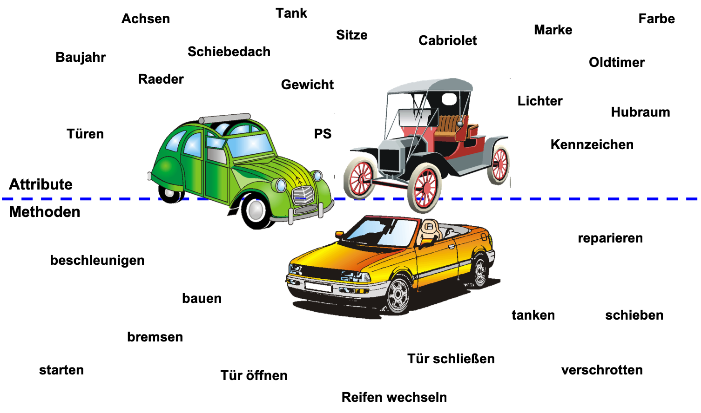<!-- .element style="border: 0px; box-shadow: 0 0 0 0" -->
</div>

----
## Einführung in die Objektorientierung

<div>

**Klassen**
* Klassen bilden den Bauplan (die Schablone) für Objekte
* nach dem Bauplan können mehrere Objekte erzeugt werden

**Objekte**
* stellen die sog. Instanz einer Klasse dar
* können erzeugt, verändert und zerstört werden
* haben eine Identität und einen Zustand

**Attribute**
* beschreiben die Eigenschaften von Objekten
* beschreiben den Zustand eines Objektes

**Methoden**
* beschreiben das Verhalten von Objekten
* stellen die Funktionalität von Objekten dar

</div><!-- .element style="font-size: 0.8em;" -->

----
### Attribute und Methoden
* Attribute sind Variable oder Konstanten innerhalb eines Objektes
* Attribute werden wie Variablen oder Konstanten deklariert
* in den Methoden werden die Algorithmen zu einem Objekt implementiert
* Methoden können einen Rückgabewert haben
* der Rückgabewert einer Methode kann von einem einfachen oder einem Referenzdatentyp oder vom Typ void sein
* Methoden vom Rückgabewerttyp void haben keinen Rückgabewert
* die Deklaration von Methoden erfolgt nach folgender Syntax

```Java
[Modifier] Typ Name ([Übergabeparameter]) {
  Anweisungen;
}
```

* sowohl Attribute und Methoden haben einen Modifier, der die Sichtbarkeit außerhalb der Klassen festlegt

---
## Darstellung von Klassen in der UML
* UML steht für Unified Modelling Language
* wird im Rahmen der objektorientierten Analyse und im objektorientierten Design eingesetzt
* beschreibt eine standardisierte Sammlung von Diagrammen
* die Diagramme werden unterschieden in
  * statische Diagramme
  * dynamische Diagramme
* Klassen werden durch Klassendiagramme dargestellt
* Klassendiagramme zählen zu den statischen Diagrammen
* in den Klassendiagrammen werden festgelegt
  * der Name der Klasse
  * die Namen und Datentypen der Attribute
  * die Namen und Rückgabewerte der Methoden
  * die Sichtbarkeit von Attributen und Methoden

----
### Darstellung der Klassen in der UML
<div align="center">
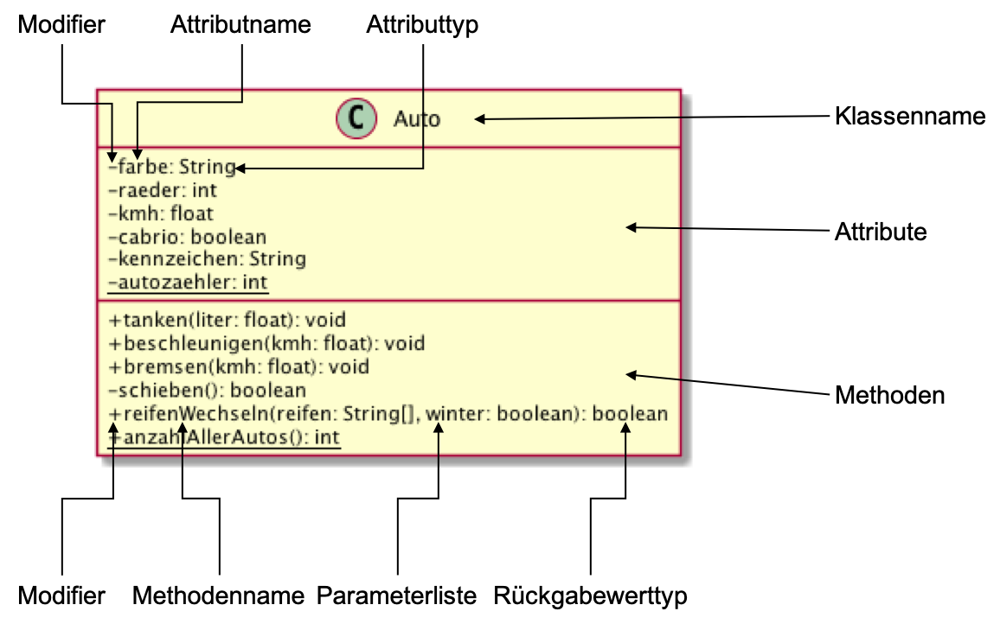<!-- .element style="border: 0px; box-shadow: 0 0 0 0" -->
</div>

---
## Objekte erzeugen

* Objekte sind Instanzen einer Klasse
* zum Erzeugen von Objekten muss zunächst eine Klasse definiert werden
  * die Definition einer Klasse beginnt mit dem Schlüsselwort class
  * innerhalb der Klasse werden die entsprechenden Attribute und Methoden zu der Klasse deklariert und implementiert
  * die Definition einer Klasse beschreibt also den Aufbau und das Verhalten einer Klasse
* Objekte werden wie folgt erzeugt
  * zunächst wird eine Variable vom Typ der Klasse deklariert
  * mit Hilfe des new-Operators wird ein neues Objekt der Klasse instanziiert und muss der Variable zugewiesen werden
  * durch Verwendung des new-Operators wird gleichzeitig für das neue Objekt Speicher allokiert
  * mit dem new-Operator wird eine spezielle Methode der Klasse implizit aufgerufen, der Konstruktor

----
### Konstruktoren
* sind spezielle Methoden zum Erzeugen von neuen Objekten einer Klasse
* Konstruktoren tragen den gleichen Namen wie die Klasse
* werden ausschließlich über den new-Operator aufgerufen
* liefern als Ergebnis die Referenz auf das neu geschaffene Objekt zurück
* es existiert ein Standardkonstruktor
  * dieser wird automatisch vom Compiler zur Verfügung gestellt, wenn in der Klassendefinition kein Konstruktor implementiert wurde
  * besitzt keine Übergabeparameter
  * sobald ein Konstruktor in der Klasse implementiert wurde, erzeugt der Compiler keinen Standardkonstruktor mehr
* Konstruktoren können dazu verwendet werden, um die Attribute zu initialisieren

----
### Beispiel für die Implementierung einer Klasse

<div>

```Java
package prog1.demos.objekt;
class Auto {

//	Deklaration der Attribute
	int ps;
	float kmh;
	String kfzKZ;
	String marke;

//	Implementierung des Konstruktors
	Auto(){
		ps = 75;
		kmh = 0;
		kfzKZ = "XX-XX 0000";
		marke = "Eigenbau";
	}

//	Implementierung der Methoden
	void beschleunigen(float pluskmh){
		kmh += pluskmh;
	}
	void bremsen(float minuskmh){
		if (kmh - minuskmh >= 0){
			kmh -= minuskmh;
		}
	}
}

```
</div><!-- .element style="font-size: 0.8em;" -->

---
## Prinzip der Kapselung

* die Kapselung ist ein Programmiergrundsatz in der objektorientierten Programmierung
* es handelt sich dabei um keine Eigenschaft der Programmiersprache Java
* Idee: auf die Attribute eines Objektes wird nicht direkt, sondern über spezielle Methoden zugegriffen
* dazu müssen die Attribute vor der Außenwelt verborgen und vor unerlaubtem Zugriff geschützt werden
* dies geschieht durch die Sichtbarkeitsmodifier
* Ziel: die Werte der Attribute dürfen nur im Sinne des Entwicklers sinnvoll verändert werden -> Plausibilitätsprüfung
* die speziellen Änderungsmethoden werden als Getter- und Setter-Methoden bezeichnet
  * Getter-Methoden dienen zum Auslesen der Attribute
  * Setter-Methoden werden zum Verändern der Attribute verwendet

----
## Sichtbarkeit von Attributen und Methoden
<div>

**private**
* nur innerhalb der Klasse sichtbar
* stärkste Form der Kapselung, da auf die Attribute und Methoden nur innerhalb der Klasse zugegriffen werden kann

**protected**
* nur innerhalb eines Paketes und in Subklassen (siehe Kapitel 6: Vererbung) sichtbar

**default**
* nur innerhalb des Paketes sichtbar

**public**
* von überall sichtbar
* normalerweise sind die Getter- und Setter-Methoden öffentlich, um auf private Attribute zuzugreifen
</div><!-- .element style="font-size: 0.8em;" -->

----
### Beispiel für Getter- und Setter-Methoden

<div>

```Java
package prog1.demos.objekt;
class Auto {

  // Deklaration der gekapselten Attribute
	private int ps;
	private float kmh;
	private String kfzKZ;
	private String marke;

  // Getter- und Setter-Methoden
	public String getKfzKZ() {
		return kfzKZ;
	}

	public void setKfzKZ(String kfzKZ) {
		this.kfzKZ = kfzKZ;
	}

	public float getKmh() {
		return kmh;
	}

	public void setKmh(float kmh) {
		this.kmh = kmh;
	}
}
```
</div><!-- .element style="font-size: 0.8em;" -->

---
## Zugriff auf Attribute und Methoden
<div>

* auf Methoden und Attribute wird in der Punktnotation zugegriffen

```Java
objektname.methode(Übergabeparameter);
objektname.attribut;
```

* Voraussetzung: die Sichtbarkeit der Methoden und Attribute lässt den direkten Zugriff zu
* call by value
  * alle Parameter werden in Java mit call by value übergeben
  * Änderungen der Werte innerhalb der Methoden haben keinen Einfluss auf den Übergabeparameter
* call by reference
  * werden Referenzdatentypen (Objekte) übergeben, steht in der Methode die Referenz auf das Orginalobjekt zur Verfügung
  * alle Methoden und Attribute zum Orginalobjekt stehen in der Methode zur Verfügung
  * Änderungen der Attribute finden somit innerhalb des Orginalobjektes statt
</div><!-- .element style="font-size: 0.8em;" -->

----
### Beispiel für Methoden- und Attributzugriffe
<div>

```Java
package prog1.demos.objekt;
class Auto {

//	Deklaration der Attribute
	private int ps;
	private float kmh;
	private String kfzKZ;
	private String marke;
	public int tueren;

//	Getter- und Setter-Methoden
	public String getKfzKZ() {
		return kfzKZ;
	}

	public void setKfzKZ(String kfzKZ) {
		this.kfzKZ = kfzKZ;
	}

	public float getKmh() {
		return kmh;
	}

	public void setKmh(float kmh) {
		this.kmh = kmh;
	}
}
```
</div><!-- .element style="font-size: 0.8em;" -->

----
### Beispiel für Methoden- und Attributzugriffe II
<div>

```Java
package prog1.demos.objekt;
class AutoTest {
	public static void main(String[] args) {

		Auto bmw = new Auto();
		Auto audi = new Auto();

		bmw.tueren = 5;
		audi.tueren = 3;

		bmw.setKfzKZ("HD-XX 321");
		audi.setKmh(135.7f);

		System.out.println("Der BMW hat das
			Kennzeichen: " + bmw.getKfzKZ());

		System.out.println("Der Audi fährt: " +
			audi.getKmh());
	}
}
```
</div><!-- .element style="font-size: 0.8em;" -->

---
## Überladene Methoden
* Methoden mit dem gleichen Namen werden innerhalb einer Klasse mehrmals definiert
* die Methoden unterscheiden sich dabei in der Anzahl und/oder in der Typisierung der Übergabeparameter
* die Modifier können dabei unterschiedliche Sichtbarkeiten zulassen
* Ziel: gleichnamige Operationen können mit unterschiedlichen Datentypen als Parameter versorgt werden
* gleichnamige Operationen können unterschiedliche Funktionalität zur Verfügung stellen
* auch Konstruktoren können überladen werden

----
### Beispiel für überladene Methoden
<div>

```Java
package prog1.demos.objekt;
class Auto {

//	Deklaration der gekapselten Attribute
	private int ps;
	private float kmh;
	private String kfzKZ;
	private String marke;

//	überladene Konstruktoren und Methoden
		Auto(){
		ps = 75; kmh = 0;
		kfzKZ = "XX-XX 0000"; marke = "Eigenbau";
	}

	public Auto(int ps, float kmh, String kfzKZ, String marke){
		this.ps = ps; this.kmh = kmh;
		this.kfzKZ = kfzKZ; this.marke = marke;
	}

	void beschleunigen(float pluskmh){
		kmh += pluskmh;
	}
	protected void beschleunigen(){
		kmh+= 10;
	}
}
```
</div><!-- .element style="font-size: 0.8em;" -->

----
### Variable Argumente - ```varargs```
* können eine beliebige Anzahl von Werten als Argumente übergeben, einschließlich gar keiner.
* intern behandelt Java die varargs-Parameter als Array des angegebenen Typs. Daher können Sie die Methoden auf Arrays anwenden (wie Schleifen oder Längenüberprüfung).
* definition über ```datentyp... name``` in der Methodensignatur
* müssen am Ende der Übergabeparameter stehen
* nur ein variables Argument pro Methode

```Java
public class VarargsExample {
    public void sumOfNumbers(int... numbers) {
        int sum = 0;
        for (int number : numbers) {
            sum += number;
        }
        System.out.println("Summe: " + sum);
    }

    public static void main(String[] args) {
        VarargsExample sumUp = new VarargsExample();

        sumUp.sumOfNumbers(1);          // Gibt: "Summe: 1"
        sumUp.sumOfNumbers(1, 2, 3);    // Gibt: "Summe: 6"
        sumUp.sumOfNumbers();           // Gibt: "Summe: 0"
    }
}
```

---
## Klassenattribute und –methoden
* Klassenattribute und –methoden existieren unabhängig von einer Instanz einer Klasse
* ohne das ein Objekt existiert können diese verwendet werden
* sie werden durch den Modifier static als Klassenattribut bzw. –methode definiert
* ZU beachten: static-Methoden können nur auf static-Attribute zugreifen, und nicht auf Instanzattribute und -methoden
* auf Klassenattribute und –methoden wird ebenfalls in der Punktnotation über den Klassennamen zugegriffen
* Darstellung in UML: Klassenattribute und -methoden werden in UML durch Unterstreichung kenntlich gemacht

----
### Beispiel für Klassenattribute und -methoden
<div>

```Java
package prog1.demos.objekt;
class Auto {

//	Deklaration der gekapselten Attribute
	private int ps;
	private float kmh;
	private String kfzKZ;
	private String marke;
	private static int autoZaehler = 0;

//	Getter- und Setter-Methoden
	Auto(){
		autoZaehler++;
		ps = 75;
		kmh = 0;
		kfzKZ = "XX-XX 0000";
		marke = "Eigenbau";
	}

	public static int getAutoZaehler() {
		return autoZaehler;
	}

	public static void setAutoZaehler(int autoZaehler) {
		Auto.autoZaehler = autoZaehler;
	}
}

```
</div><!-- .element style="font-size: 0.8em;" -->

----
### Beispiel für Klassenattribute und -methoden II
<div>

```Java
package prog1.demos.objekt;
class AutoTest {
	public static void main(String[] args) {

		System.out.println(Auto.getAutoZaehler());

		Auto bmw = new Auto();
		Auto audi = new Auto();

		System.out.println(Auto.getAutoZaehler());

		bmw.tueren = 5;
		audi.tueren = 3;

		bmw.setKfzKZ("HD-XX 321");
		audi.setKmh(135.7f);

		System.out.println("Der BMW hat das
			Kennzeichen: " + bmw.getKfzKZ());

		System.out.println("Der Audi fährt: " +
			audi.getKmh());
	}
}

```
</div><!-- .element style="font-size: 0.8em;" -->

---
## Mini-Exkurs: Enumerations (Enum)
* Spezielle Klasse (erbt von java.lang.Enum)
* definiert eine Menge an gültigen Werten
* bietet Prüfung auf gültige Werte zur Kompilierungs- und Laufzeit
* Naming Convention: Enum-Klassenname UpperCamelCase, Werte UPPER_CASE

```Java
public enum CarBrand {
  MERCEDES,
  BMW,
  FORD,
  TESLA
}
```

----
### Mini-Exkurs: Enum als Klasse
* kann Konstruktor, Attribute und Methoden haben
* Konstanten werden als Objekt der Enum(-Klasse) instanziiert (Singleton)

```Java
public enum CarBrand {
  MERCEDES("$$$"),
  BMW("$$$"),
  FORD("$"),
  TESLA("$$");

  private String priceClass;

  public CarBrand(String priceClass){
    this.priceClass = priceClass;
  }

  public String getPriceClass(){
    return priceClass;
  }
}
```

---
## Initialisierungs-Codeblöcke (!)
* stehen im Kontext einer Klasse 
* werden als spezielle ("namenlose") Methoden kompiliert
* Objekt- und Klassen-Initialisierungs-Codeblöcke
  * Objekt: laufen vor jedem Konstruktoraufruf
  * Klasse: laufen einmalig vor dem ersten Zugriff auf die Klasse (kennzeichnung durch ```static```)
* können für komplexe Initialisierungen genutzt werden

```Java
public class Car {
  // ...

  private static int carCount;
  private static String nextDefaultColor;

  // Klassen-Initialisierungs-Codeblock
  static{
    carCount = DataBaseService.getCurrentNumberOfCars();
  }

  // Objekt-Initialisierungs-Codeblock
  {
    nextDefaultColor = CarStatisticService.getLessUsedColor();
  }
}
```


---
## Objekte löschen mit dem Garbage-Collector
<div>

* nicht mehr benötigte Objekte belasten den Speicher und müssen daher „eingesammelt“ werden
* diese Aufgabe übernimmt der Garbage Collector
* benötigte Objekte sind dadurch gekennzeichnet, dass sie noch referenziert sind (reachable)
* sobald keine Referenzvariable mehr auf das Objekt verweist, wird das Objekt vom Garbage Collector zerstört (unreachable)
* Java verfügt über eine automatische Garbage Collection
* der Garbage Collector in Java startet, wenn die Virtual Machine für neue Objekte Speicherplatz benötigt
* explizit kann der Garbage Collector auch über den Befehl System.gc(); gestartet werden
* der Garbage Collector ruft den Destruktor eines Objektes
* (**Deprecated**) Destruktoren sind parameterlose Methoden mit dem Namen

```Java
protected void finalize();
```

</div><!-- .element style="font-size: 0.8em;" -->

---
## Beziehungen zwischen Objekten

----
### Assoziation
* beschreibt die Struktur einer Menge von Beziehungen zwischen Objekten
* binäre Assoziationen beschreiben die Beziehung zwischen je zwei Klassen
* Assoziationen können benannt werden, durch eine verbale Beschreibung der Beziehung
* die Darstellung in der UML erfolgt durch eine einfache Verbindungslinie zwischen den Klassen
<div align="center">
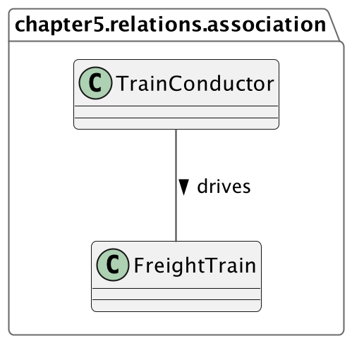<!-- .element style="border: 0px; box-shadow: 0 0 0 0" -->
</div>
----
### Aggregation
* Aggregationen stellen eine spezielle Form der Assoziation dar
* Aggregationen stellen eine „Teile-Ganzes-Beziehung“ oder „Besteht-aus-Beziehung“ dar
* Aggregationen beschreiben keine existentielle Abhängigkeiten
* Beispiel: die Beziehung zwischen einem Güterwagon und der Fracht; der Wagon existiert auch ohne Fracht
* die Notation in der UML erfolgt durch eine Linie mit einer Raute am Ende, wobei die Raute bei der Aggregatsklasse (dem Ganzen) angesiedelt ist
<div align="center">
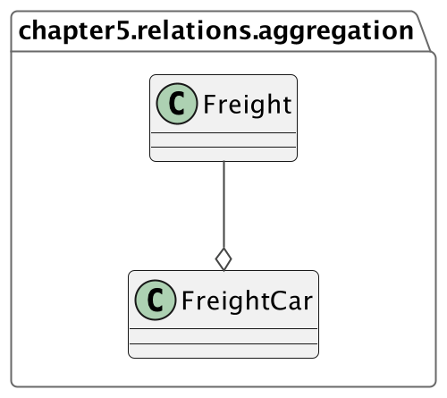<!-- .element style="border: 0px; box-shadow: 0 0 0 0" -->
</div>
----
### Komposition
* die Komposition ist eine spezielle Form der Aggregation
* Kompositionen sind „strenger“ als Aggregationen
* es handelt sich ebenfalls um eine „Teile-Ganzes-Beziehung“
* die Existenz des Ganzen ist im Unterschied zur Aggregation von der Existenz des einzelnen Teils abhängig
* Beispiel: ein Güterzug kann nur dann existieren, wenn mind. eine Zuglokomotive und mind. ein Güterwagon existiert
* die Darstellung erfolgt analog der Aggregation nur mit einer ausgefüllten Raute
<div align="center">
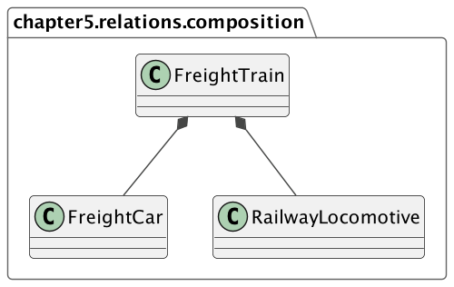<!-- .element style="border: 0px; box-shadow: 0 0 0 0" -->
</div>

----
### Kardinalität (Multiplizität)
* Beschreibt die mengen- / zahlenmässige Ausprägung einer Beziehung (Assoziation)
* Werden an der Assoziation eingetragen
<br/>

<div>

<table border = 2>
<tr>
  <td>  
    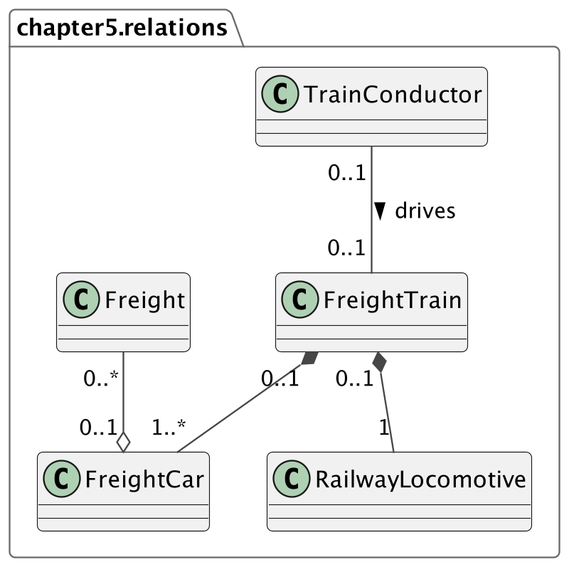<!-- .element style="border: 0px; box-shadow: 0 0 0 0" -->
  </td>
  <td>
    <table border = 2>
      <tr><td align=center><b>Kardinalität</b></td><td><b>Beschreibung</b></td></tr>
      <tr><td align=center>1</td><td>Ein Objekt muss genau einem anderen Objekt zugeordnet sein (MUSS-Beziehung, siehe Komposition)</td></tr>
      <tr><td align=center>0..1</td><td>Es kann ein oder kein Objekt dem anderen zugeordnet sein (Kann-Beziehung)</td></tr>
      <tr><td align=center>0..n</td><td>Es können beliebig viele Objekte einem anderen Objekt zugeordnet sein (Kann-Beziehung)</td></tr>
      <tr><td align=center>1..n</td><td>Es muss mindestens ein Objekt bis beliebig viele Objekte einem anderen Objekt zugeordnet sein (MUSS-Beziehung, siehe Komposition)</td></tr>
    </table>
  </td>
  
</tr>
</table>

</div><!-- .element style="font-size: 0.7em;" -->


---
# Kapitel 6
# Vererbung

----
## Übersicht
1. Einführung
2. Grundlagen von Java
3. Datentypen
4. Ausdrücke und Anweisungen
5. Objektorientierung
6. **Vererbung**
7. Interfaces

----
## Lernziele
* Sie können die Eigenschaften der Vererbung beschreiben.
* Sie können den Unterschied von Super- und Subklassen beschreiben und den Begriff der Vererbungshierarchie erläutern.
* Sie können die Begriffe Generalisierung und Spezialisierung im Zusammenhang mit der Vererbung erklären.
* Sie können Vererbungsbeziehungen in der UML darstellen.
* Sie können das Vererbungskonzept in Java beschreiben.
* Sie kennen die Eigenschaften der Klasse Object.
* Sie können Methoden überschreiben.
* Sie kennen die Bedeutung der Modifier abstract und final.
* Sie können die Bedeutung von this und super erklären.
* Sie kennen die Konzepte des narrowing und widening casts.
* Sie können den Begriff der Polymorphie erklären.

---
## Eigenschaften der Vererbung
* eine Unterklasse (Subklasse) erbt die Attribute und Methoden einer Oberklasse (Superklasse)
* statt Vererbung spricht man auch vom Ableiten von Klassen eine Subklasse leitet sich aus einer oder mehreren Superklassen ab
* es entsteht eine Vererbungshierarchie, die theoretisch beliebig tief geschachtelt werden kann
* i.d.R. besitzt die Subklasse noch zusätzliche Attribute und Methoden
* Ziel und Vorteil: bestehender Programmcode kann wieder verwendet werden (Reuse)
* Mehrfachvererbung besagt, dass eine Subklasse von mehreren Superklassen erbt
* Superklassen stellen eine Generalisierung ihrer Subklassen dar
* umgekehrt sind Subklassen Spezialisierungen ihrer Superklassen

----
### Darstellung der Vererbung in UML

<div align="center">
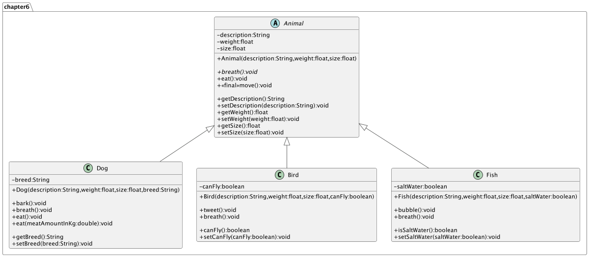<!-- .element style="border: 0px; box-shadow: 0 0 0 0" -->
</div>


---
## Vererbung in Java

----
### Übersicht
* Java unterstützt nur die Einfach- und nicht die Mehrfachvererbung
* über Interfaces (Kapitel 7) kann auf mehrere Klassen Bezug genommen werden
* die Vererbung ist durch folgende Syntax definiert:

```JAVA
class Subklasse extends Superklasse { }
```

* mit extends verweist die Subklasse auf ihre Superklasse
* nach extends darf lediglich eine Superklasse angegeben werden
* alle Attribute und Methoden mit Ausnahme der Konstruktoren der Superklasse werden an die Subklasse vererbt
* in der Subklasse kann die Funktionalität der abgeleiteten Klasse erweitert und verändert werden
  * Hinzufügen von Methoden und Attributen
  * Überladen von Methoden
  * Überschreiben von Methoden

----
### Die Superklasse **Object**
* ist die Wurzel der Klassenhierarchie in Java
* liegt im Paket java.lang
* von ihr sind alle Klassen explizit oder implizit abgeleitet, d.h. jede eigene Klasse ist immer eine Subklasse von Object
* damit stehen alle Methoden der Klasse Object in allen abgeleiteten Klassen zur Verfügung
  * Object() – parameterloser Konstruktor
  * toString() – Konvertierung eines Objekts in einen String ausgeführt
  * equals() – vergleicht zwei Objekte miteinander
  * hashCode() – berechnet den Hashwert eines Objektes
  * clone() – kopiert zwei Objekte
  * finalize() – ist der Destruktor
* in Referenzvariablen vom Typ Object können alle beliebigen Objektreferenzen gespeichert werden (vgl. Narrowing cast)

----
### Sichtbarkeit von Methoden und Attributen
<div>

private
* nur innerhalb der Klasse sichtbar
* stärkste Form der Kapselung, da auf die Attribute und Methoden nur innerhalb der Klasse zugegriffen werden kann

**protected**
* **nur innerhalb eines Paketes und in Subklassen (siehe Kapitel 6: Vererbung) sichtbar**

default
* nur innerhalb des Paketes sichtbar

public
* von überall sichtbar
* normalerweise sind die Getter- und Setter-Methoden öffentlich, um auf private Attribute zuzugreifen
</div><!-- .element style="font-size: 0.8em;" -->

---
## Methoden überschreiben
<div>

* Methoden, die bereits in der Superklasse implementiert sind, können in Subklassen neu definiert werden (Überschreiben)
* zur Laufzeit wird entschieden, welche Methode konkret ausgeführt wird (dynamisches Binden)
* dabei sucht die JVM zunächst in der Klasse des Referenzdatentyps nach einer passenden Methode
* wird dort keine passende Methode gefunden, wird die Vererbungshierarchie von unten nach oben nach einer passenden Methode durchsucht
* dies erfordert zusätzliche Rechnerkapazität und wirkt sich daher negativ auf die Performance aus
* das Überschreiben kann durch zwei Modifier vermieden werden
  * private &#8658; Methode ist in Subklasse nicht sichtbar
  * final &#8658; verhindert explizit das Überschreiben
* die Sichtbarkeit bei überschriebenen Methoden darf erhöht aber nicht eingeschränkt werden
</div><!-- .element style="font-size: 0.8em;" -->

----
----
### Mini-Exkurs: Enum als veerbte Klasse
* Enums Erben von java.lang.Enum
* ```toString()```- Methode von Objekt Überschrieben
  * geben den Namen des Konstanten-Wertes zurück
  * kann weiter auf Klassen- und Objekt-Ebene überschrieben werden  

```Java
public enum CarBrand {
  MERCEDES("$$$"),
  BMW("$$$"),
  FORD("$"),
  TESLA("$$"){
        @Override
        public String toString() {
            return super.toString() + " voll elektrisch";
        }
    };

  // ...

  @Override
    public String toString() {
        return switch(this){
            case TESLA -> "Tesla";
            case FIAT -> "Fiat";
            case MERCEDES -> "Mercedes";
            case BMW -> "BMW";
        } +  "(" + priceClass + ")";
    }
}
```


---
## Weitere Modifier
<div>

**abstract**
* abstrakte Klassen sind i.d.R. noch nicht ausreichend spezialisiert und dienen nur als grobe Vorlage für Subklassen
* von abstrakten Klassen können keine Objekte erzeugt werden
* beinhaltet eine Klasse mind. eine abstrakte Methode, so muss die Klasse abstrakt werden
* abstrakte Methoden beinhalten nur den Methodenkopf, aber keine Implementierung im Methodenrumpf
* Subklassen von abstrakten Superklassen müssen alle abstrakten Methoden der Superklasse implementieren (konkrete Klasse) oder selbst abstrakt werden
* UML: Abstrakte-Klassen und -Methoden werden in UML durch kursiv-Schreibweise kenntlich gemacht

**final**
* Klassen, die mit dem Modifier final versehen sind, dürfen nicht weiter abgeleitet werden
* Methoden mit dem Modifier final dürfen nicht überschrieben werden final-Attribute sind Konstanten, deren Wert sich nicht verändern darf

</div><!-- .element style="font-size: 0.8em;" -->

---
## Bedeutung von this und super
* mit dem Ausdruck super kann aus einer abgeleiteten Klasse mithilfe der Punktnotation auf Attribute und Methoden der Superklasse zugegriffen werden
* ein kaskadierender Aufruf super.super.x() ist nicht möglich
* this ist eine Referenzvariable, die beim Anlegen des Objekts automatisch erzeugt wird und auf das aktuelle Objekt zeigt
* über die this-Referenz können eigene Methoden, Instanz- und Klassenattribute angesprochen werden
* mithilfe von this(Übergabeparamter) oder super(Übergabeparameter) können Konstruktoren verkettet werden
* this() und super() müssen bei verketteten Konstruktoraufrufen immer die als erste Anweisung im Konstruktor stehen
* this() verweist auf Konstruktoren der aktuellen und super() auf Konstruktoren der Superklasse

---
## Casting von Referenztypen

----
### Narrowing Cast
* Objekte von Subklassen können in Referenzvariablen gespeichert werden, die vom Typ ihrer Superklasse sind
* dabei wird nur die Sicht auf die Objekte beschränkt, d.h. es sind nur noch die Attribute und Methoden sichtbar, die in der Superklasse deklariert sind
* die subklassen-spezifischen Attribute und Methoden sind noch vorhanden, aber vorübergehend ausgeblendet
* der narrowing cast beschreibt also den Wechsel von einer Sicht mit mehr auf eine Sicht mit weniger Details bei einem Objekt
* der narrowing cast ist ein wesentliches Prinzip im Vererbungskonzept von Java
* der narrowing cast ist eine wesentliche Voraussetzung für die Polymorphie

----
### Widening Cast

<div>

* stellt die Umkehrung des narrowing cast dar
* Referenzen auf Objekte, die in einer Referenzvariable vom Typ der Superklasse gespeichert sind, sollen in einer Referenzvariable vom Typ der Subklasse gespeichert werden
* es handelt sich dabei um eine unsichere Konvertierung
  * es muss sichergestellt werden, dass es sich bei den Referenzen um Referenzen auf Objekte der Subklasse handelt
  * vor der Umwandlung muss der Typ der Referenz mit dem Operator instanceof überprüft werden &#8658; ```referenzvariable instanceof Subklasse``` muss true ergeben
  * bei der Durchführung muss ein expliziter Cast auf den Typ der Subklasse durchgeführt werden

```Java
refSubklasse = (Subklasse)referenzdatentyp;

```


* der widening cast wechselt von einer Sicht mit weniger auf eine Sicht mit mehr Details und blendet die subklassen-spezifischen Attribute und Methoden wieder ein

</div><!-- .element style="font-size: 0.8em;" -->


---
## Polymorphie

----
### Übersicht
* neben der Kapselung und der Vererbung ein weiteres Grundkonzept in der objektorientierten Programmierung
* bedeutet die Vielgestaltigkeit von Objekten
* basiert auf dem Konzept des dynamischen Bindens
* gleiche Methodenaufrufe rufen unterschiedliche Verhaltensweisen der Objekte hervor
* Beispiel:

<!-- .element style="border: 0px; box-shadow: 0 0 0 0" -->


----
### Beispiel Quellcode

```Java
package prog1.demos.objekt;

class AutoTest {
  public static void main(String[] args) {

    Tier[] x = new Tier[2];

    x[0] = new Hund(25.5f, "Bello", 15.8f, "Schäferhund");  //Narrowing Cast
    x[1] = new Vogel(10.4f, "Tweety", 0.4f, true);          //Narrowing Cast

    x[0].atmen();
    x[1].atmen();
  }
}
```

---

# Kapitel 7
# Interfaces

----
## Übersicht
1. Einführung
2. Grundlagen von Java
3. Datentypen
4. Ausdrücke und Anweisungen
5. Objektorientierung
6. Vererbung
7. **Interfaces**

----
## Lernziele
* Sie können die wesentlichen Eigenschaften von Interfaces beschreiben.
* Sie können Interfaces deklarieren und implementieren.
* Sie können Interfaces vererben.
* Sie können Interfaces in der UML darstellen.
* Sie kennen die besondere Bedeutung von Interfaces in Bezug auf Mehrfachvererbung.
* Sie können Polymorphie mit Hilfe von Interfaces realisieren.
* Sie können Objekte kopieren

---
## Eigenschaften von Interfaces
<div>

* Interfaces stellen eine besondere Form der Klassen dar
* sie definieren lediglich den Aufbau der Schnittstelle
  * Name von Methoden
  * Signaturen der Methoden
  * Attribute
* Interfaces sollen keine eigene Funktionalität beinhalten (Standard-Implementierungen seit Java 8 möglich)
* die Funktionalität wird in Klassen implementiert, die das Interface nutzen wollen
* sie beinhalten ausschließlich abstrakte, öffentliche Methoden
* alle Attribute sind als Konstanten festgelegt
* Deklaration von Interfaces mit dem Schlüsselwort interface
* Interfaces können von anderen Interfaces mit extends abgeleitet (vererbt) werden
* Interfaces können genau wie Klassen als Datentyp für Referenzvariablen genutzt werden

</div><!-- .element style="font-size: 0.8em;" -->

----
### Implementierung von Interfaces

<div>

* um zu einem Interface die Funktionalität zur Verfügung zu stellen, muss eine Klasse das Interface implementieren
* dies erfolgt durch den Zusatz implements zur class-Anweisung z.B.

```Java
class xyz implements abc { }
```

* die Klasse muss alle Methoden des Interfaces implementieren oder als abstrakte Klasse deklariert werden
* Klassen können im Gegensatz zur Vererbung mehrere Interfaces implementieren z.B.

```Java
class xyz implements abc, def { }
```

* durch die Implementierung mehrerer Interfaces wird eine Art von Mehrfachvererbung realisiert
* Objekte einer Klasse sind zu allen Interface-Datentypen kompatibel, sobald die Klasse das Interface implementiert z.B. alle Objekte der Klasse xyz könnten in Referenzvariablen vom Typ abc oder def gespeichert werden
</div><!-- .element style="font-size: 0.8em;" -->

---
## Darstellung in UML

<div align="center">
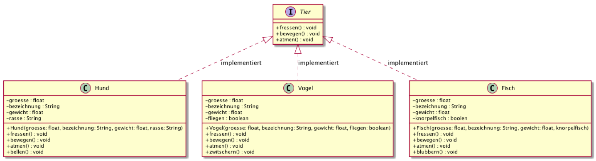<!-- .element style="border: 0px; box-shadow: 0 0 0 0" -->
</div>

---
## Polymorphie über Interfaces
<div>

* analog der Polymorphie durch Vererbung
* Unterschied
  * Polymorphie durch Vererbung: Objekte einer Subklasse werden in Referenzvariablen vom Typ der Superklasse gespeichert
  * Polymorphie durch Interfaces: Objekte der implementierenden Klasse werden in Referenzvariablen vom Typ des implementierten Interfaces gespeichert
* Beispiel:

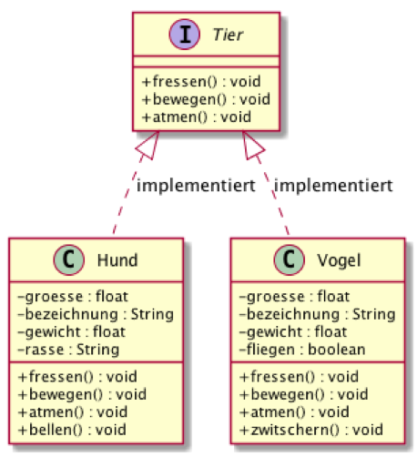<!-- .element style="border: 0px; box-shadow: 0 0 0 0" -->

</div><!-- .element style="font-size: 0.7em;" -->
----
### Beispiel Quellcode

```Java
package prog1.demos.objekt;
class AutoTest {
  public static void main(String[] args) {

    Tier[] x = new Tier[2];

    x[0] = new Hund();    //Narrowing Cast		
    x[1] = new Vogel();   //Narrowing Cast

    x[0].atmen();
    x[1].atmen();
  }
}
```

---
## Exkurs: kopieren von Objekten (!)

1. "Möglichkeit"
  * mit dem =-Operator
  * es wird lediglich die Referenz auf das Objekt kopiert
  * nach der Zuweisung verweisen beide Referenzvariablen auf dasselbe Objekt (keine wirkliche Kopie!)
2. Möglichkeit
  * mit der clone()-Methode
  * es wird eine identische Kopie des Objektes erzeugt und unter einer anderen Referenz im Speicher hinterlegt
  * die Attributwerte der beiden Objekte sind gleich


---
# Exkurs
# Naming Conventions

> siehe "Exkurs" Skript
